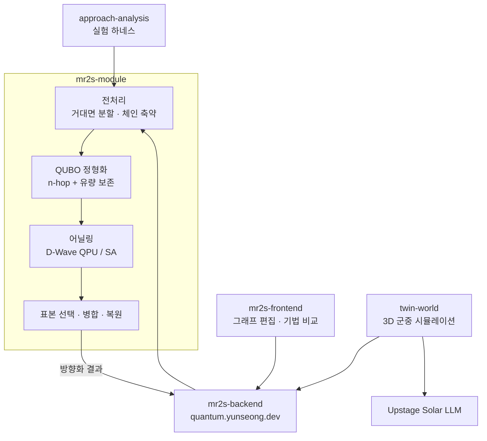
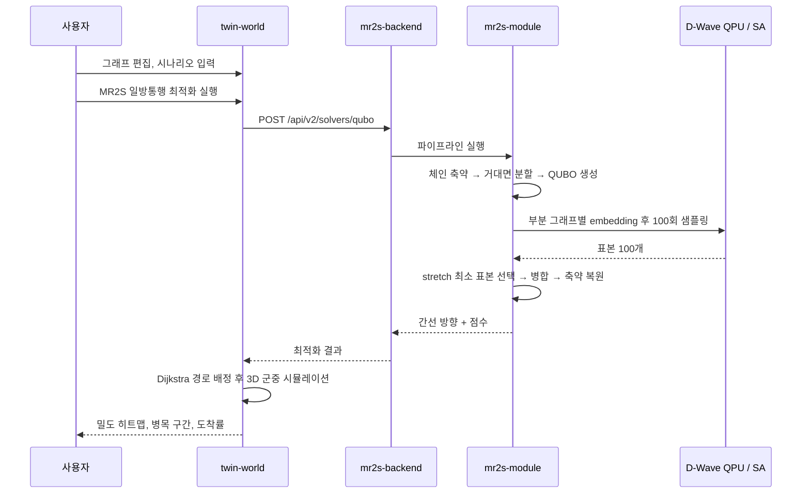
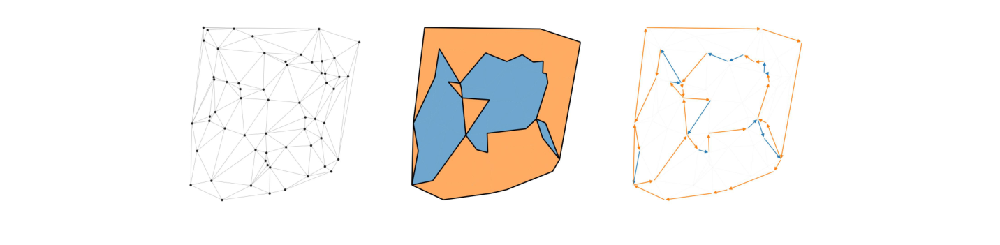
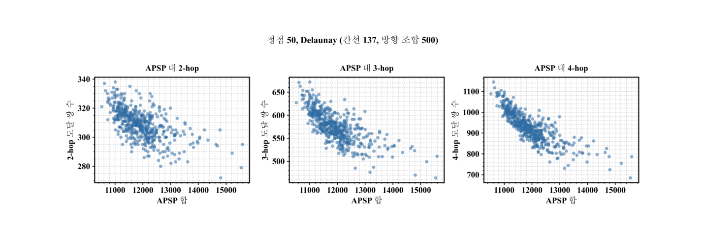
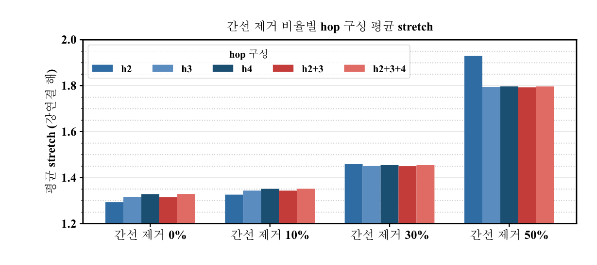
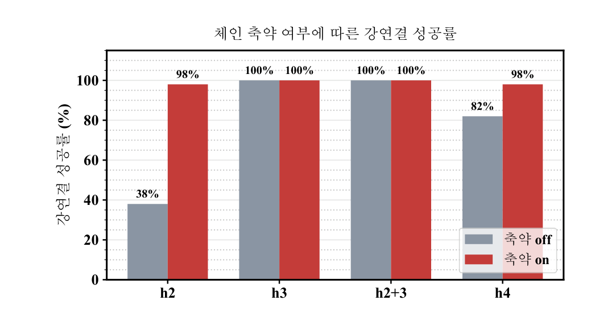
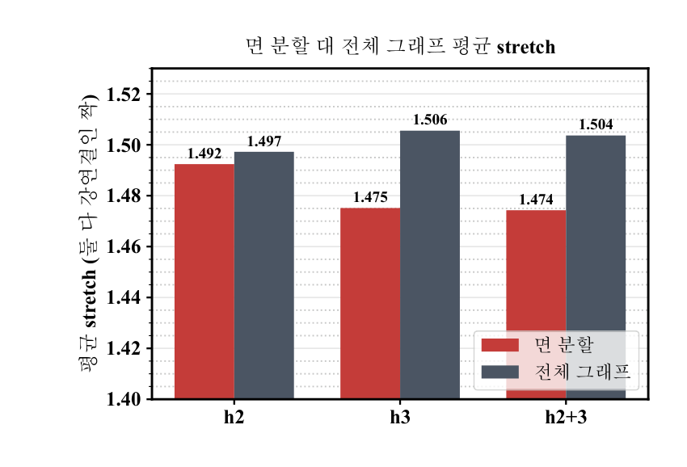
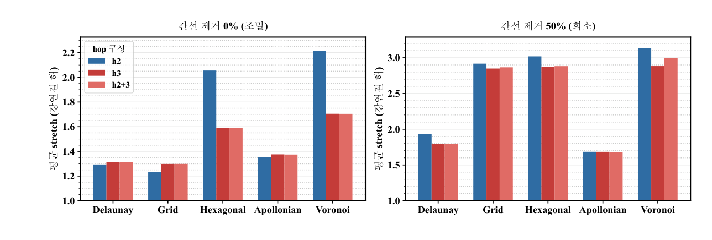
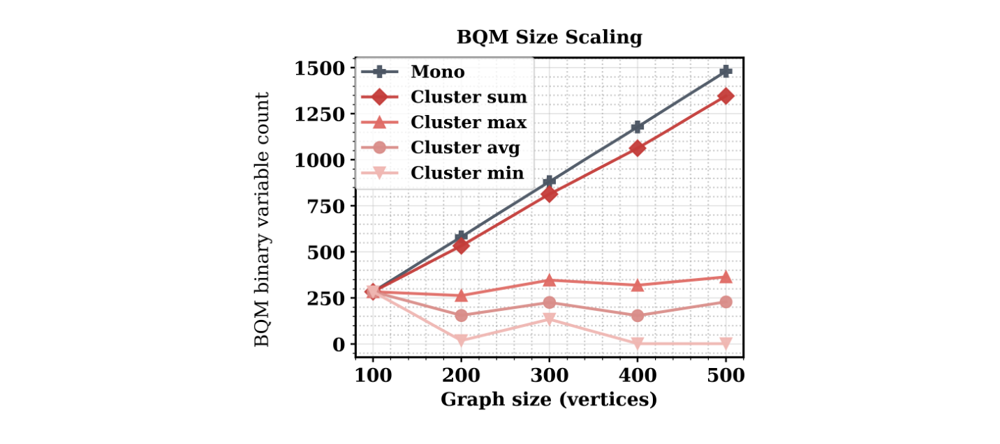
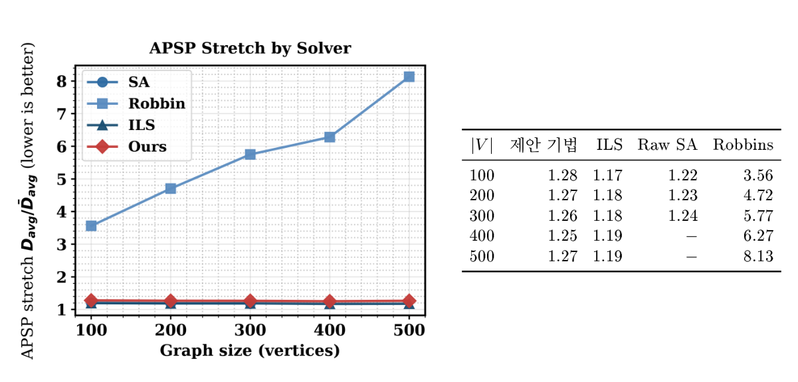

# MR2S — 양자 어닐링 기반 다중 밀집 사고 예방을 위한 보행자 네트워크 방향성 최적화

부산대학교 정보컴퓨터공학부 2026년 전기 졸업과제 36조 · Quantum Guardian

보행로 네트워크의 모든 간선에 일방통행 방향을 부여해, 어디에서 어디로든 갈 수 있는 상태(strong connectivity)를 유지하면서 대향류 충돌과 우회 거리를 줄인다. 방향 배정 문제를 QUBO(Quadratic Unconstrained Binary Optimization)로 정형화해 D-Wave 양자 어닐러에서 풀고, 그 결과를 디지털 트윈 Twin World 의 군중 시뮬레이션으로 검증한다. 프레임워크 이름 MR2S 는 Metropolitan Ring Road System 이다.

---

### 1. 프로젝트 배경

#### 1.1. 국내외 시장 현황 및 문제점

- **다중 밀집 사고는 보행 동선 설계 문제다.** 좁은 공간에서 보행자 흐름이 통제력을 잃는 군중 유체화 현상으로 사고가 일어나며, 주요 원인 중 하나는 서로 반대 방향으로 움직이는 조밀한 흐름이 부딪히는 대향류(opposing flows) 충돌이다.
- **일방통행 설계는 계산이 어렵다.** Robbins(1939)는 2-edge-connected 그래프라면 강연결 방향화가 항상 존재함을 보였으나, 그중 전 정점 쌍 최단 경로(APSP) 기준으로 최적인 것을 찾는 문제는 NP-hard 다. 간선이 $|E|$개면 탐색 공간이 $2^{|E|}$로 팽창한다.
- **양자 어닐링을 쓰려면 모델을 다시 설계해야 한다.** 강연결성은 네트워크 전체를 도는 순환 구조에 걸리는 전역 조건이라 저차 다항식으로 표현되지 않고, Pegasus $P_{16}$ 은 고정된 희소 그래프라 minor embedding 이 먼저 한계에 닿는다.

#### 1.2. 필요성과 기대효과

- 축제·행사장은 사고가 난 뒤에 동선을 고칠 수 없다. 행사 전에 동선안을 수치로 비교할 수단이 필요하다.
- 방향 최적화(MR2S)와 군중 시뮬레이션(Twin World)을 한 흐름으로 묶어, 최적화 전후의 밀도·병목·도착률을 같은 조건에서 비교한다.
- 정점 500개 네트워크에서 제안 기법의 거리 비율(stretch)은 1.25–1.28이고, 같은 품질대의 ILS(44,862초) 대비 약 1/10.5 시간에 해를 얻는다(4.5절).
- 정형화 자체는 보행로에 한정되지 않는 일반적인 강연결 방향 최적화 방법론이며, 다중 밀집 사고 예방은 그 대표적인 응용이다.

---

### 2. 개발 목표

#### 2.1. 목표 및 세부 내용

| 목표 | 세부 내용 | 결과물 |
| --- | --- | --- |
| 보조 변수 없는 QUBO 정형화 | $n$-hop 도달 경로 수 최대화를 이동 효율의 대리 목적으로 쓰고, 경로와 역경로가 짝을 이뤄 최고차 항이 상쇄되는 성질로 $n\in\{2,3\}$ 에서 2차식을 유지한다. 여기에 유량 보존 항을 더한다 | `mr2s-module/mr2s_module/qubo` |
| 전역 조건의 국소화 | 평면 그래프의 단위 면을 거대면(macro-face)으로 군집화하고 경계를 봉합해 순환 방향을 주어, 전역 강연결 조건을 부분 그래프의 국소 조건으로 낮춘다 | `mr2s-module/mr2s_module/cycle` |
| 하드웨어 탑재 최적화 | degeneracy 판정으로 분할 수 $k$를 이분 탐색하고, 차수 2 체인을 초간선으로 축약해 Pegasus $P_{16}$ 에 실을 크기로 줄인다 | `mr2s_module/reduction`, `mr2s_module/solver/partition` |
| 서비스화와 검증 | 최적화를 HTTP API 로 제공하고, 방향화 결과를 디지털 트윈 군중 시뮬레이션으로 동적 검증한다 | `mr2s-backend`, `mr2s-frontend`, `twin-world` |

#### 2.2. 기존 서비스 대비 차별성

| 항목 | 기존 방식 | 본 과제 |
| --- | --- | --- |
| 강연결성 처리 | QUBO 의 penalty term 으로 강제 → 전역 조건이라 저차로 표현되지 않고, 큰 페널티가 어닐러의 유효 분해능을 잠식한다 | 전처리에서 경계 사이클로 순환 골격을 세우고, 에너지 함수에는 도달 가능성 항만 남긴다 |
| 목적 함수 차수 | 도달성을 직접 쓰면 3차 이상이라 보조 변수가 필요하다(4-hop 은 변수 약 8배) | 최고차 항이 상쇄되는 $n\in\{2,3\}$ 만 써서 보조 변수 없이 2차 유지 |
| 부분 문제 분해 | 제약 없는 QUBO 가 대상이라 부분해를 단순 병합해도 된다 | 병합 후에도 강연결성이 유지되도록 면 단위로 나누고 거대면마다 순환 방향을 준다 |
| 문제 크기 | 정점 500개의 전체 QUBO 는 변수 1,481개, 탐색 예산 안에 embedding 실패 | 분할 후 최대 부분 그래프 평균 263–365개, 정점 500개까지 전부 embedding 성공 |
| 검증 방법 | 정적 경로 지표만 본다 | 같은 그래프를 3D 군중 시뮬레이션에 넣어 밀도·병목까지 확인한다 |

#### 2.3. 사회적 가치 도입 계획

- **공공 안전**: 주최자가 행사 전에 동선안을 바꿔가며 병목과 밀집 위험을 확인할 수 있게 한다.
- **기존 인프라 재사용**: 길을 새로 내지 않고 방향만 바꾸므로 추가 공사가 필요 없다.
- **공개와 재현성**: 알고리즘을 `mr2s-module` 라이브러리로 분리하고 실험 하네스와 결과 원본을 `approach-analysis/results` 에 남겼다. 양자 어닐러가 없는 환경을 위해 simulated annealing backend 를 같은 인터페이스로 제공한다.

---

### 3. 시스템 설계

#### 3.1. 시스템 구성도

최적화 파이프라인(`mr2s-module`)이 전처리 → QUBO 정형화 → 어닐링 실행으로 방향화 결과를 산출하고, 디지털 트윈(`twin-world`)은 그 결과를 입력으로 받는 별도의 검증·시연 도구다.



#### 3.2. 사용 기술

| 구분 | 기술 |
| --- | --- |
| 최적화 라이브러리 | Python 3.11+, `dwave-ocean-sdk`, `minorminer`, `networkx`, `numpy` |
| 양자 하드웨어 | D-Wave Advantage QPU (Pegasus $P_{16}$, 5,640 qubits), minor embedding 은 minorminer(예산 1,000초, 고정·재사용). 고전 backend 는 `dwave.samplers` 의 C++ simulated annealing |
| 백엔드 | FastAPI, uvicorn, pydantic, `mr2s-module`, Docker + GitHub Container Registry |
| 웹 클라이언트 | React 19, TypeScript 5.9, Vite 7, Three.js + `@react-three/fiber`, `@xyflow/react`, i18next(한국어·영어·일본어) |
| 시뮬레이션 | 시각 휴리스틱 보행 모델(Moussaïd 등), 몸체 접촉력 모델(Helbing 등), Dijkstra 경로 탐색 |
| 실험·분석 | matplotlib, scipy, pytest, Wilcoxon 부호 순위 검정, Redis + AWS Batch + Amazon S3 분산 실행 |
| 배포 | Vercel(`twin-world`, `mr2s-frontend`), GitHub Pages(`twinworld.maechuri.com`) |

---

### 4. 개발 결과

#### 4.1. 전체 시스템 흐름도



거대면 분할 전처리는 ① 평면 embedding 에서 단위 면과 중심 좌표를 계산하고, ② 최원점 샘플링으로 초기 중심 $k$개를 고른 뒤, ③ k-means 로 모든 면을 군집에 배정하고, ④ 외벽에 높은 비용을 둔 최소 비용 T-조인으로 경계를 닫고, ⑤ 각 거대면에 순환 방향을 부여한다. 인접한 거대면은 2-채색이 가능하므로 반대 방향을 주면 공유 경계에서 지시가 일치한다.



*원본 그래프(좌), 추출된 거대면(중), 순환 방향화 결과(우) — 최종보고서 그림 3.2*

#### 4.2. 기능 설명 및 주요 기능 명세서

**HTTP API** (`mr2s-backend`, base URL `https://quantum.yunseong.dev`) — 입력은 정점·간선 목록과 가중치, 출력은 간선별 방향과 점수(stretch, 강연결 여부, 유량 균형)다.

| method | path | 설명 |
| --- | --- | --- |
| `GET` | `/api/v2/solvers` | 사용 가능한 solver 목록과 옵션 조회 |
| `POST` | `/api/v2/solvers/{solver_name}` | solver 를 경로 parameter 로 선택(`qubo`, `raw-sa`, `robin`) |
| `POST` | `/api/v1/mr2s` | MR2S 파이프라인 고정 실행 |
| `POST` | `/api/v1/raw-sa` | 방향 벡터를 직접 탐색하는 simulated annealing |
| `POST` | `/api/v1/brute-force` | 전수 탐색, 소규모 그래프 검증용 |

**라이브러리 공개 인터페이스** (`mr2s-module`)

| 구분 | 이름 |
| --- | --- |
| 데이터 모델 | `Graph`, `Edge`, `Solution`, `Score` |
| 분할·축약 | `FaceClusterPartition`, `KMeansFaceClusterer`, `BalancedFaceGraphClusterer`, `SnowballFaceClusterer`, `mr2s_module.reduction` |
| QUBO | `FlowPolyGenerator`, `NHopPolyGenerator`, `QuboSolver`, `create_sa_solver`, `create_qa_solver` |
| 평가·파이프라인 | `ApspSumRanker`, `Evaluator`, `QuboMR2SSolver`, `DnCMr2sSolver`, `SAMR2SSolver`, `RobbinMR2SSolver`, `IlsMR2SSolver` |
| 비교 대상 | `Robbin`, `Tjoin` |

**디지털 트윈** (`twin-world`) — 보행로 그래프를 편집하고 MR2S 최적화를 적용한 뒤, Dijkstra 로 목적지를 배정한 3D 군중 시뮬레이션을 실행한다. 결과는 밀도 히트맵과 병목 지점으로 시각화되며, 최적화 전후 시나리오의 도착률·대피시간·밀도를 나란히 비교하고 Markdown 분석 보고서로 내보낼 수 있다. 자연어로 입력한 시나리오는 Upstage Solar LLM 이 인원수 등 조건으로 구조화한다.

#### 4.3. 디렉토리 구조

```
capstone-2026-team-36
├── README.md
├── install_and_build.sh      전체 구성 요소 설치·빌드 스크립트
├── docs/                     제출 문서 (보고서 · 포스터 · 발표자료 · 자문의견서 · README 그림)
├── mr2s-module/              핵심 알고리즘 라이브러리 (Python)
│   └── mr2s_module/          domain · reduction · cycle · qubo · solver · edge_orient · evaluator
├── mr2s-backend/             최적화 HTTP API (FastAPI): router · service · domain · dto
├── mr2s-frontend/            그래프 편집과 기법 비교 웹 클라이언트 (React)
├── twin-world/               디지털 트윈 시뮬레이션 (React + Three.js)
├── simulation-react/         2D 군중 시뮬레이션 선행 프로토타입
├── approach-analysis/        대규모 실험 하네스와 결과 원본 (results/)
└── documents/                논문 한국어판·영어판, 보고서 원고, AQC 학회 원고, 소개 영상
```

#### 4.4. 산업체 멘토링 의견 및 반영 사항

자문: 샌드버그 이세진 이사, 2026년 8월 7일 서면 자문 (`docs/04.자문의견서/산업체_자문의견서.pdf`).

| 자문 의견 | 반영 사항 |
| --- | --- |
| 초기 목표 대비 정량적 달성률(%)을 추진 계획표와 담당 업무에 표기할 것 | 최종보고서 5장 개발 일정표에 항목별 달성률을 명시했다(4.6절) |
| AQC 학회 포스터 발표 피드백과 보완 로드맵을 연계할 것 | 발표와 실기 검증에서 확인된 embedding 규모 한계와 점수 정규화 필요성을 stretch 기반 정규화와 체인 축약으로 반영했다 |
| 정적 경로 지표 외에 시뮬레이션을 통한 밀집 완화 효과를 제시할 것 | Twin World 의 밀도 히트맵·병목 시각화와 최적화 전후 비교 분석을 결과물에 포함했다 |

#### 4.5. 실험 결과 및 평가

품질 지표는 stretch(방향화 전후 최단 거리 비율, 1이 최적), 실행 가능성은 강연결 성공률, 비용은 실행 시간과 QUBO 변수 수다. 같은 그래프·같은 반복이 동일한 seed 를 공유하는 짝지은 비교이며, 유의성은 Wilcoxon 부호 순위 검정으로 확인했다.

**(1) n-hop 대리 목적의 타당성** — 정점 50개(간선 137개) 그래프에서 강연결 방향 조합 500개를 뽑아 거리 합과 $n$-hop 도달 쌍 수의 상관을 측정했다. $n=2,3,4$ 모두 뚜렷한 음의 상관이 나타나 대리 목적으로서 타당하다. 홉 길이를 $\{2,3\}$ 으로 한정한 근거는 상관의 우열이 아니라 2차식이 보장되는 차수 조건이다.



*왼쪽부터 $n=2,3,4$ — 최종보고서 그림 4.1*

**(2) hop 구성 실험 (본 실행 10,000회 + 대조 실행 2,000회)** — 정점 100–500 × 시드 10개 × 간선 제거 0/10/30/50% 의 Delaunay 그래프 200개에 hop 구성 5종 × 체인 축약 on/off × 5회 반복을 돌렸다. 조밀한 그래프에서는 2-hop 이, 희소한 그래프에서는 3-hop 계열이 좋았다. 4-hop 계열은 변수 수와 실행 시간만 늘 뿐 어느 밀도에서도 3-hop 보다 낫지 않았다.

| 간선 제거 | h2 | h3 | h4 | h2+3 | h2+3+4 |
| --- | --- | --- | --- | --- | --- |
| 0% | **1.294** | 1.315 | 1.327 | 1.315 | 1.328 |
| 10% | **1.326** | 1.344 | 1.351 | 1.344 | 1.352 |
| 30% | 1.460 | 1.450 | 1.455 | **1.450** | 1.455 |
| 50% | 1.930 | 1.794 | 1.797 | **1.793** | 1.797 |



*최종보고서 그림 4.2*

**(3) 차수 2 체인 축약** — 해 품질은 거의 그대로(stretch 차이 0.02 이하) 두면서 희소 그래프의 실행 시간을 최대 42%, QUBO 변수 수를 최대 89개(약 20%) 줄였다. 가장 큰 효과는 실행 가능성으로, 간선 50% 제거·정점 500 그래프에서 2-hop 의 강연결 성공률이 **38%에서 98%로** 올랐다.



*최종보고서 그림 4.3*

**(4) 거대면 분할** — 전체 그래프를 한 QUBO 로 푸는 대조 실험에서 4-hop 계열은 강연결 해를 얻지 못했으나, 면 분할을 적용하면 96–100%의 성공률을 보였다. 해 품질도 3-hop 계열에서 stretch 를 0.02–0.04 개선했다($p<10^{-4}$).



*4-hop 계열은 전체 그래프 방식이 강연결 해를 얻지 못해 비교에서 제외 — 최종보고서 그림 4.4*

**(5) 그래프 계열 일반화** — grid, hexagonal, apollonian, voronoi 4개 계열에 같은 실험 행렬을 적용했다. 조밀할 때 2-hop, 희소할 때 3-hop 으로 갈리는 전환은 grid 에서도 재현되었고($p<0.001$), 차수 3 계열(hexagonal, voronoi)에서는 실험한 밀도 구간 전체에서 3-hop 항이 필수임이 새로 드러났다. 격자 계열은 강연결 성공률 자체가 낮아 개선 여지를 남겼다.



*최종보고서 그림 4.5*

**(6) D-Wave 실기 검증과 고전 기법 비교** — 정점 100–500 Delaunay 그래프 15개 인스턴스를 D-Wave Advantage QPU 에서 부분 그래프별 100회 샘플링했다.

| 기법 | 거리 비율(방향화 후/전) | 인스턴스당 시간(초, $\|V\|=500$) | 강연결 확보 |
| --- | --- | --- | --- |
| 제안 기법 (D-Wave QA) | 1.25–1.28 | 16.9 (+4,243 embedding 탐색) | 14/15회 |
| ILS | 1.17–1.19 | 44,862 | 15/15회 |
| Raw SA | 1.22–∞ | 101,597 | 9/15회 |
| Robbins | 3.56–8.13 | 3.5 | 15/15회 |

분할하지 않으면 $|V|=100$ 에서만 평균 3,008개 물리 큐비트로 embedding 되고 $|V|\geq200$ 에서는 예산 안에 찾지 못했다. 분할하면 $|V|=500$ 까지 모든 부분 그래프가 embedding 되었다(부분 그래프당 최대 4,391개로 5,640개 이내). 총 4,260초 중 4,243초가 embedding 탐색이고 실제 QUBO 풀이는 16.9초이므로, 구조가 같은 지형에 반복 적용하면 embedding 을 재사용해 수십 초 수준까지 내려갈 여지가 있다.



*Mono 는 분할하지 않은 전체 그래프 QUBO, Cluster 는 면 분할 후 부분 그래프들의 합계·최대·평균·최소 — 최종보고서 그림 4.6*



*Ours 는 제안 기법, SA 는 Raw SA — 최종보고서 그림 4.7*

**(7) 디지털 트윈 검증** — Twin World 에서 최적화 전후 시나리오를 비교해, 밀도 히트맵과 병목 시각화로 대향류 충돌 구간이 해소되고 최대 밀집 구간의 밀도가 완화됨을 확인했다.

자세한 내용은 `docs/01.보고서/03.최종보고서.pdf` 4장, 결과 원본은 `approach-analysis/results` 에 있다.

#### 4.6. 개발 일정 및 달성률

| 추진 항목 | 기간 | 달성률 |
| --- | --- | --- |
| 문제 정의·이론 연구 및 QUBO 모델 설계 | 2026. 3.–5. | 100% |
| 거대면 분할 전처리 및 소규모 벤치마크 (착수보고) | 2026. 4.–5. | 100% |
| AQC 2026 학회 포스터 발표 | 2026. 6. | 100% |
| D-Wave 실기 실행 및 embedding 대응 (중간보고) | 2026. 6.–7. | 100% |
| 모듈 최적화 (체인 축약·stretch 정규화·가중치 조정) | 2026. 7.–8. | 100% |
| 대규모 실험 (10,000회) 및 그래프 계열 일반화 실험 | 2026. 8. | 100% |
| Twin World 시뮬레이션 개발 및 동적 검증 | 2026. 7.–9. | 100% |
| 최종 보고서 작성 및 발표 준비 | 2026. 9. | 100% |

#### 4.7. 대외 성과

- **AQC 2026 학회 포스터 발표** (2026년 6월) — 연구 내용을 공유하고 피드백을 확보했다.
- **오제키 교수(Prof. Ozeki) 연구실 협력** — 실제 양자 어닐링 하드웨어 접근 권한을 지원받아 실기 검증을 수행했다.
- **Twin World 해커톤 수상**

---

### 5. 설치 및 실행 방법

#### 5.1. 설치절차 및 실행 방법

Python 3.11 이상과 Node.js 20.19 이상(또는 22.12 이상)이 필요하다. D-Wave 계정과 `DWAVE_API_TOKEN` 은 선택이며, 없으면 simulated annealing backend 로 전부 실행된다.

```bash
./install_and_build.sh          # 전체 설치·빌드
```

```bash
# 알고리즘 라이브러리
cd mr2s-module
python -m venv .venv && source .venv/bin/activate
pip install -e ".[test]" && pytest
python tests/run_sa_qubo_solver_demo.py --num-points 20 --num-reads 30 \
    --remove-ratio 0.3 --use-face-cycle --target-k 8

# 최적화 API 서버
cd ../mr2s-backend && pip install -r requirements.txt && python main.py

# 웹 클라이언트 (mr2s-frontend, twin-world, simulation-react)
cd ../twin-world && cp .env.example .env.local   # UPSTAGE_API_KEY 설정
npm install && npm run dev

# 실험 재현
cd ../approach-analysis && pip install -r requirements.txt
python main.py poster-results --sizes 5 10 20 --output-dir results/poster --no-cache
```

`mr2s-backend` 는 8000번 포트, 웹 클라이언트는 Vite 기본 포트인 5173번을 쓴다. 웹 클라이언트는 배포된 백엔드(`https://quantum.yunseong.dev`)를 프록시로 호출하므로, 로컬 백엔드를 쓰려면 `vite.config.ts` 의 프록시 대상 또는 `twin-world` 의 `VITE_PROXY_TARGET` 을 `http://localhost:8000` 으로 바꾼다.

#### 5.2. 오류 발생 시 해결 방법

| 증상 | 해결 |
| --- | --- |
| `create_qa_solver` 가 자격 증명 오류로 실패 | `DWAVE_API_TOKEN` 을 설정하거나 `~/.config/dwave/dwave.conf` 를 만든다. 하드웨어 없이 돌리려면 `create_sa_solver` 를 쓴다 |
| embedding 탐색이 끝나지 않는다 | `DnCMr2sSolver` 로 거대면 분할을 켠다. 정점 200개 이상은 분할 없이 embedding 되지 않는다 |
| 강연결 해를 얻지 못한다 | 체인 축약을 켠다. 희소한 그래프에서 성공률이 38%에서 98%로 올라간다 |
| 브라우저 콘솔에 CORS 오류 | Vite 프록시나 `vercel.json` rewrite 를 통해 상대 경로로 호출한다 |
| `pytest` 가 매우 오래 걸린다 | `python -m pytest -m "not slow"` 로 실행한다 |
| `approach-analysis` 결과가 보고서 수치와 다르다 | `requirements.txt` 가 고정한 `mr2s-module==0.1.4` 를 그대로 쓴다 |

---

### 6. 소개 자료 및 시연 영상

#### 6.1. 프로젝트 소개 자료

| 자료 | 위치 |
| --- | --- |
| 착수·중간·최종 보고서 | `docs/01.보고서/` |
| 포스터 | `docs/02.포스터/포스터파일.pdf` |
| 발표자료 | `docs/03.발표자료/` |
| 산업체 자문의견서 | `docs/04.자문의견서/산업체_자문의견서.pdf` |
| 논문 한국어판·영어판 | `documents/paper/ko/main.pdf`, `documents/paper/en/main.pdf` |

> **작성 필요** — `docs/03.발표자료/` 의 두 파일은 아직 0바이트 자리표시자다.

#### 6.2. 시연 영상

소개 영상 페이지는 `documents/video/introduction/` 에 있고 GitHub Pages 로 배포된다. 약 5분 40초 분량이며, 발표 시연 자료로는 Twin World 시뮬레이션을 사용한다.

> **작성 필요** — 아래 링크를 실제 영상 주소로 바꾼다.
>
> ```markdown
> [](https://www.youtube.com/watch?v={동영상ID})
> ```

| 배포된 데모 | 주소 |
| --- | --- |
| Twin World | https://twin-world.vercel.app · https://twinworld.maechuri.com |
| 최적화 API | https://quantum.yunseong.dev |

---

### 7. 팀 구성

#### 7.1. 팀원별 소개 및 역할 분담

| 학번 | 성명 | 역할 |
| --- | --- | --- |
| 202155585 | 이요환 | 그래프 전처리 이론 연구 및 거대면 분할 기법 개발 / 체인 축약 등 문제 규모 최적화 / `mr2s-module`·`mr2s-backend` 개발 / 대규모 실험 하네스 구축 / 보고서 작성 |
| 202155604 | 정윤성 | QUBO 목적 함수 정형화 및 최적화 / n-hop 접근법 이론 탐구 및 개발 / D-Wave Pegasus 토폴로지 대응(minor embedding) / `mr2s-module`·`mr2s-backend` 개발 / 연구 활동 기록화 및 포스터 작성 |
| 202155529 | 김세엽 | 디지털 트윈 시뮬레이션(Twin World) 및 `mr2s-frontend` 개발 / 테스트 코드 구현 및 통합 실행 / 프로젝트 서버 관리 / AQC 학회 포스터 발표 / 대외 소통 |

지도교수: 황원주 (부산대학교 정보융합공학과)

#### 7.2. 팀원 별 참여 후기

**이요환** — 면 분할과 체인 축약은 종이 위에서 정리한 뒤에도 실제 그래프에서는 경계가 닫히지 않는 경우가 계속 나와서, 예외를 하나씩 메우는 데 시간을 가장 많이 썼다. 10,000회 실험 하네스를 만들며 결과를 믿으려면 재현 가능한 기록이 먼저라는 것을 배웠다.

**정윤성** — 목적 함수를 2차식으로 떨어뜨리는 조건을 찾는 데 오래 걸렸다. 하드웨어에 올려 보고 나서야 변수 수보다 커플링 밀도가 먼저 한계에 닿는다는 것을 알았고, 모델 설계와 실행 환경을 같이 봐야 한다는 점을 늦게 배웠다.

**김세엽** — 최적화 결과를 숫자로만 보다가 시뮬레이션으로 옮기니 어디가 막히는지가 눈에 보였다. Unity 에서 웹으로 옮기는 결정은 늦었지만, 덕분에 발표와 공유가 훨씬 수월해졌다.

---

### 8. 참고 문헌 및 출처

1. D. Helbing, L. Buzna, A. Johansson, and T. Werner, "Self-Organized Pedestrian Crowd Dynamics: Experiments, Simulations, and Design Solutions," *Transportation Science*, vol. 39, no. 1, pp. 1–24, 2005.
2. H. E. Robbins, "A Theorem on Graphs, with an Application to a Problem of Traffic Control," *The American Mathematical Monthly*, vol. 46, no. 5, pp. 281–283, 1939.
3. F. Glover, G. Kochenberger, and Y. Du, "A Tutorial on Formulating and Using QUBO Models," arXiv:1811.11538, 2018.
4. C. Duhamel and A. C. Santos, "The Strong Network Orientation Problem," *International Transactions in Operational Research*, vol. 31, no. 1, pp. 192–220, 2024.
5. H. Ushijima-Mwesigwa, R. Shaydulin, C. F. A. Negre, S. M. Mniszewski, Y. Alexeev, and I. Safro, "Multilevel Combinatorial Optimization across Quantum Architectures," *ACM Transactions on Quantum Computing*, vol. 2, no. 1, art. 1, 2021.
6. J. Edmonds and E. L. Johnson, "Matching, Euler Tours and the Chinese Postman," *Mathematical Programming*, vol. 5, no. 1, pp. 88–124, 1973.
7. I. G. Rosenberg, "Reduction of Bivalent Maximization to the Quadratic Case," *Cahiers du Centre d'Études de Recherche Opérationnelle*, vol. 17, pp. 71–74, 1975.
8. D-Wave Systems Inc., *Ocean SDK Documentation*. https://docs.ocean.dwavesys.com
9. M. Moussaïd, D. Helbing, and G. Theraulaz, "How Simple Rules Determine Pedestrian Behavior and Crowd Disasters," *PNAS*, vol. 108, no. 17, pp. 6884–6888, 2011.
10. D. Helbing, I. Farkas, and T. Vicsek, "Simulating Dynamical Features of Escape Panic," *Nature*, vol. 407, pp. 487–490, 2000.
11. J. Cai, W. G. Macready, and A. Roy, "A Practical Heuristic for Finding Graph Minors," arXiv:1406.2741, 2014.
