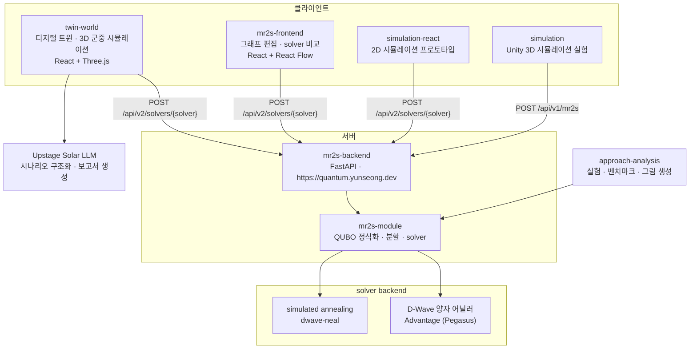
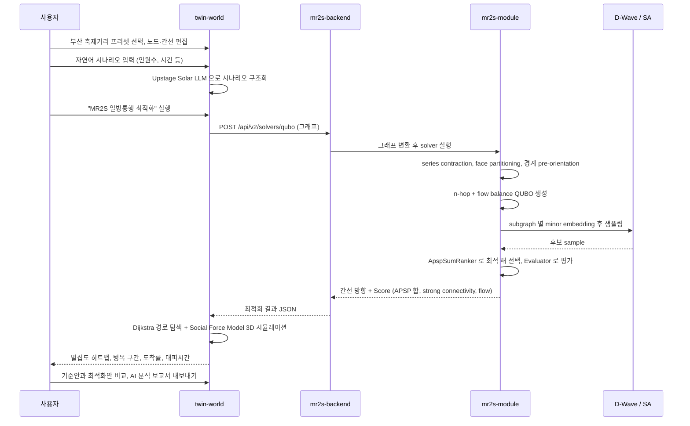
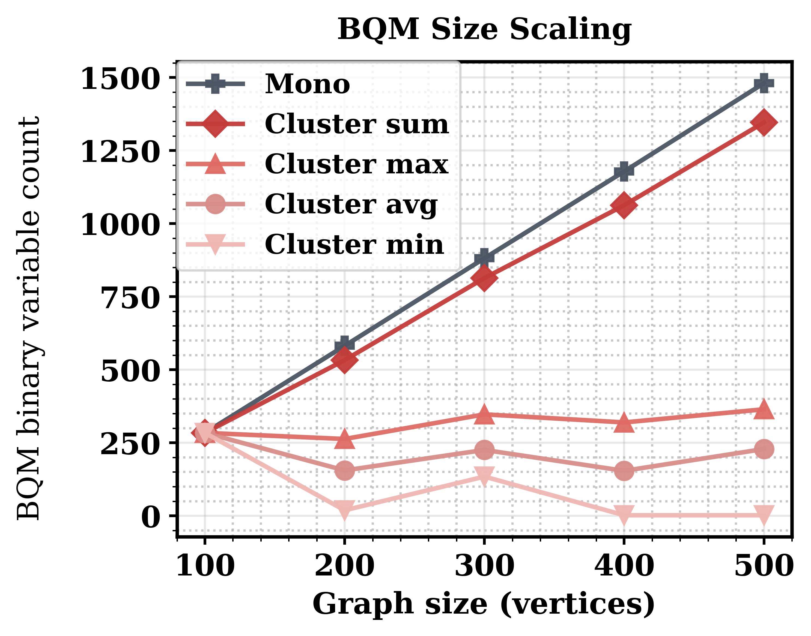
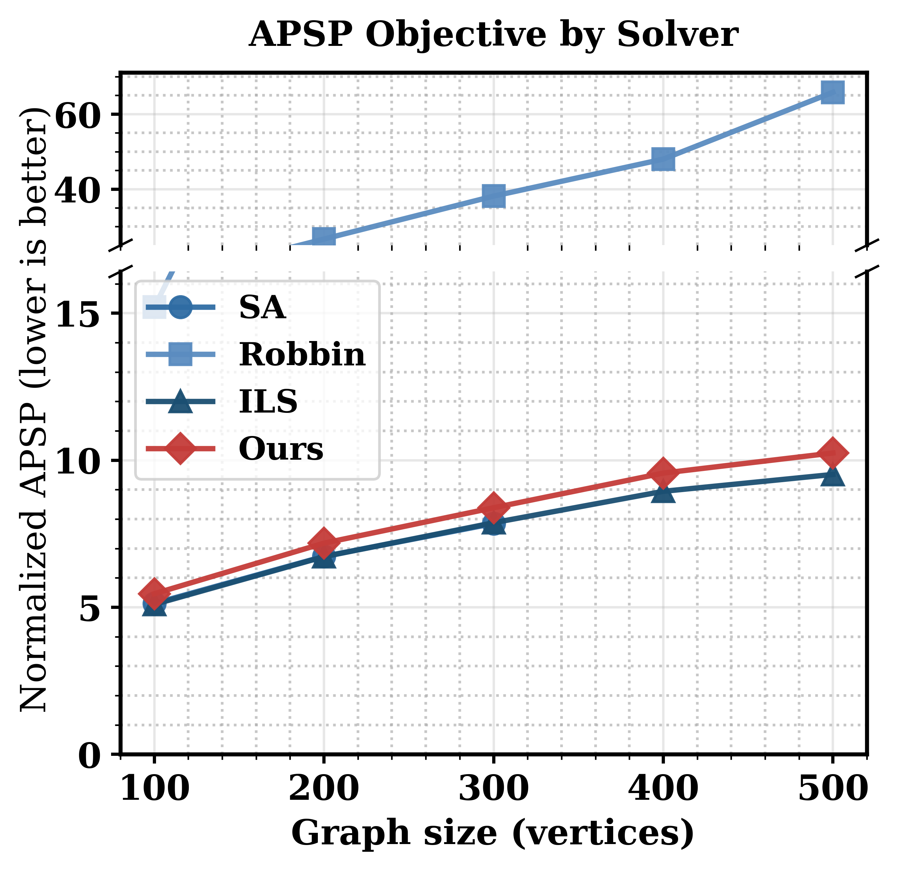
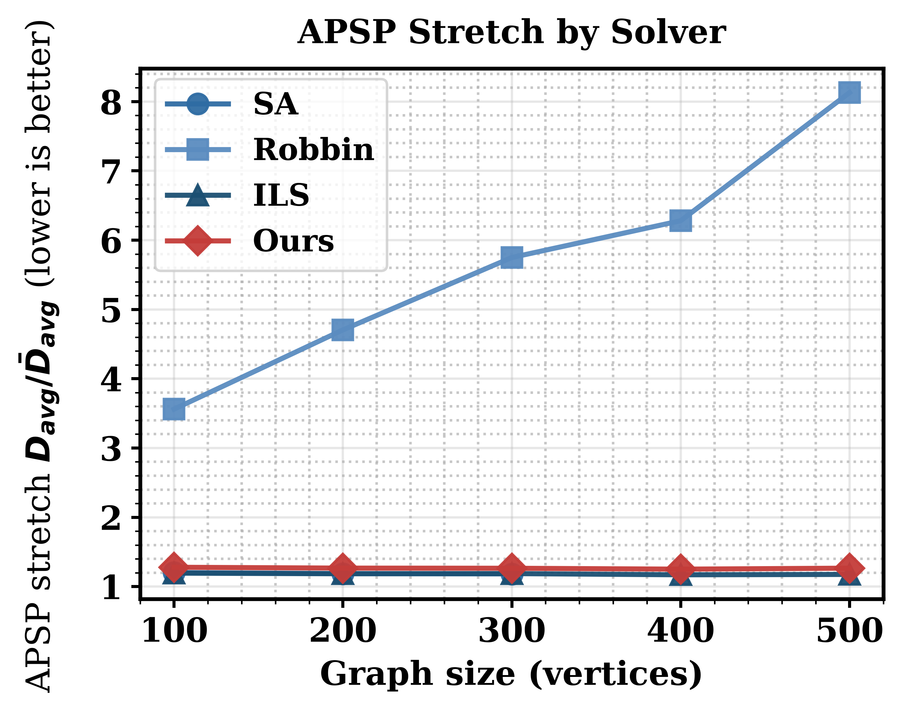

# MR2S — 양자 어닐링 기반 보행 네트워크 일방통행 최적화

부산대학교 정보컴퓨터공학부 2026년도 졸업과제 36조 · Quantum Guardian 팀

양방향 보행로 네트워크의 모든 간선에 일방통행 방향을 부여해, 어디에서 어디로든 갈 수 있는 상태(strong connectivity)를 유지하면서 대향류 충돌과 우회 거리를 줄이는 것이 이 과제의 목표다. 방향 배정 문제를 QUBO(Quadratic Unconstrained Binary Optimization) 모델로 정식화하고 D-Wave 양자 어닐러에서 풀며, 그 결과를 축제 공간 디지털 트윈 위에서 군중 시뮬레이션으로 검증한다.

---

### 1. 프로젝트 배경

#### 1.1. 국내외 시장 현황 및 문제점

- **군중 압착 사고는 보행 동선 설계 문제다.** 좁은 공간에서 서로 반대 방향으로 움직이는 대향류가 충돌하면 개인이 이동성을 잃고 정체가 발생하며, 이것이 압사 사고로 이어진다(`documents/report/main.tex`, 서론). 이태원 참사가 대표적인 사례이고, 군중 재해의 원인과 예방은 Fruin(1993) 이래 계속 연구되어 온 주제다.
- **일방통행 설계는 오래된 해법이지만 계산이 어렵다.** Robbins(1939)는 bridge 가 없는 연결 그래프라면 모든 길을 일방통행으로 바꾸고도 임의의 두 지점 사이 왕래가 가능함을 증명했고, 이후 연구는 우회 거리 증가를 최소화하는 one-way road network 설계로 이어졌다(Drezner & Wesolowsky, 1997). 그러나 간선이 $|E|$개면 방향 배정의 경우의 수가 $2^{|E|}$로 늘어나고, strong connectivity 와 이동 거리 목적을 동시에 다루면 복잡도가 더 올라간다(Burkard et al., 1999; Bang-Jensen et al., 2023).
- **기존 접근의 한계.** 군중 시뮬레이션, 대피 모델, 재난 시 차로를 역방향으로 돌리는 contraflow 전략은 모두 주어진 동선안을 평가하는 데 초점이 있다. 반대로 동선안 자체를 최적화하는 쪽은 classical 계산 자원만으로 대규모 네트워크의 해를 현실적인 시간 안에 얻기 어렵다(`documents/paper/en/main.tex`, Section 1).
- **양자 어닐링을 쓰려면 모델 자체를 다시 설계해야 한다.** strong connectivity 는 개별 간선의 국소적 선택이 아니라 네트워크 전체를 도는 순환 구조에 걸리는 전역 제약이라, QUBO 의 penalty term 으로 표현하기 어렵다. 또한 현재 하드웨어에서 실행하려면 minor embedding 이 가능해야 하는데, 변수와 coupling 이 많아지면 embedding 자체가 실패한다.

#### 1.2. 필요성과 기대효과

- 축제·행사장처럼 하루 수만 명이 좁은 구역을 통과하는 공간은 사고가 난 뒤에 동선을 고칠 수 없다. **행사 전에 동선안을 수치로 비교할 수 있는 수단**이 필요하다.
- 이 과제는 동선 최적화(MR2S)와 군중 시뮬레이션(Twin World)을 한 흐름으로 묶어, 기준안과 최적화안의 도착률·대피시간·병목 구간·밀집도를 같은 조건에서 비교할 수 있게 한다.
- 정량적 기대효과는 5절과 4.5절에 정리했다. 요약하면 제안 방법은 500개 정점 네트워크에서 Robbins 방법 대비 평균 유향 거리 $D_{\mathrm{avg}}$를 6배 이상 낮추면서, 가장 좋은 품질을 내는 iterated local search 대비 약 1/10 시간에 해를 얻는다.
- 정식화 자체는 보행로에 한정되지 않는다. 일방통행 도로망 설계, 창고 통로 설계처럼 순환 네트워크를 설계하는 문제에 그대로 적용할 수 있다.

---

### 2. 개발 목표

#### 2.1. 목표 및 세부 내용

| 목표 | 세부 내용 | 결과물 |
| --- | --- | --- |
| 보조 변수 없는 QUBO 정식화 | $n$-hop 도달성을 대리 목적 함수로 쓰고, 유향 walk 가 역방향 walk 와 짝을 이뤄 최고차 항이 상쇄되는 성질로 2차식을 유지한다 | `mr2s-module/mr2s_module/qubo` |
| 전역 제약의 국소화 | series contraction 과 face partitioning 으로 그래프를 나누고 cluster 경계를 유향 cycle 로 미리 고정해, strong connectivity 를 각 subgraph 의 국소 조건으로 낮춘다 | `mr2s-module/mr2s_module/cycle`, `mr2s_module/reduction` |
| 실제 양자 하드웨어 실행 | 분할된 subgraph 를 D-Wave 양자 어닐러에 minor embedding 해서 샘플링한다 | `mr2s-module/mr2s_module/qubo/solver.py` 의 `create_qa_solver` |
| 서비스화 | 최적화를 HTTP API 로 제공하고, 웹 클라이언트와 디지털 트윈에서 호출한다 | `mr2s-backend`, `mr2s-frontend`, `twin-world` |
| 검증 | 군중 시뮬레이션으로 기준안과 최적화안을 비교하고, 알고리즘 성능을 classical 방법과 벤치마크한다 | `twin-world`, `approach-analysis` |

주요 기능은 다음 네 가지다.

1. **일방통행 방향 최적화** — 무방향 그래프를 입력받아 각 간선의 방향, APSP 합, strong connectivity 여부, 정점별 flow 균형을 돌려준다.
2. **solver 비교** — QUBO(양자 어닐링/simulated annealing), Raw SA, Robbins, iterated local search, brute force 를 같은 입력에서 비교한다.
3. **디지털 트윈 시뮬레이션** — 부산 축제거리 그래프 위에서 Social Force Model 기반 3D 군중 시뮬레이션을 돌려 밀집도 히트맵과 병목 구간을 본다.
4. **분석 보고서 생성** — 시뮬레이션 결과를 Upstage Solar LLM 으로 정리해 Markdown 보고서로 내보낸다.

#### 2.2. 기존 서비스 대비 차별성

| 항목 | 기존 방식 | 본 과제 |
| --- | --- | --- |
| strong connectivity 처리 | penalty term 으로 QUBO 에 추가 → 가중치 조정이 필요하고 전역 제약을 국소 상호작용으로 표현하기 어렵다 | face partitioning 과 경계 pre-orientation 으로 순환 구조를 미리 세워 penalty term 없이 보장 |
| 목적 함수 차수 | 도달성을 직접 쓰면 3차 이상이 되어 보조 변수와 degree reduction 이 필요하다 | $n\in\{2,3\}$ 에서 최고차 항이 상쇄되는 성질(Proposition 1)로 보조 변수 없이 2차 유지 |
| 문제 크기 | 500개 정점 그래프의 전체 QUBO 는 1,481개 변수, 1,000초 예산 안에 embedding 실패 | 분할 후 최대 subgraph 평균 263–365개 변수, 500개 정점까지 전부 embedding 성공 |
| 계산 시간 | iterated local search 는 500개 정점에서 인스턴스당 44,862초 | 제안 방법은 합계 4,260초 (약 1/10) |
| 검증 방법 | 알고리즘 지표만 보고 | 같은 그래프를 3D 군중 시뮬레이션에 넣어 도착률·대피시간·병목까지 비교 |

#### 2.3. 사회적 가치 도입 계획

- **공공 안전**: 축제·행사 주최자가 행사 전에 동선안을 바꿔가며 병목과 밀집 위험을 확인할 수 있게 한다. 사고가 난 뒤의 대응이 아니라 설계 단계의 예방을 목표로 한다.
- **공개와 재현성**: 알고리즘은 `mr2s-module` 파이썬 라이브러리로 분리하고, 실험 코드와 결과 원본(JSON, 그림)을 `approach-analysis/results` 에 그대로 남겨 누구나 재현할 수 있게 했다.
- **기존 인프라 재사용**: 도로나 보행로를 새로 만들지 않고 방향만 바꾸는 접근이라, 추가 공사 없이 기존 공간의 수용 능력을 끌어올린다.
- **하드웨어 접근성**: 양자 어닐러가 없는 환경을 위해 simulated annealing backend 를 같은 인터페이스로 제공해, 자격 증명 없이도 전체 흐름을 실행할 수 있다.

---

### 3. 시스템 설계

#### 3.1. 시스템 구성도



#### 3.2. 사용 기술

| 구분 | 기술 |
| --- | --- |
| 최적화 라이브러리 | Python 3.11+, `dwave-ocean-sdk`, `minorminer`, `dwave-networkx`, `networkx`, `numpy`, hatchling + hatch-vcs |
| 양자 하드웨어 | D-Wave 양자 어닐러 (Pegasus $P_{16}$, 5,640 qubits), minor embedding 은 minorminer |
| 백엔드 | FastAPI 0.133.0, uvicorn 0.41.0, pydantic 2.12.5, `mr2s-module` 0.1.8, Docker, GitHub Container Registry |
| 웹 클라이언트 | React 19, TypeScript 5.9, Vite 7, Three.js + `@react-three/fiber` + `@react-three/drei`, `@xyflow/react`, `@dagrejs/dagre`, i18next (한국어·영어·일본어) |
| 시뮬레이션 | Social Force Model, Dijkstra 경로 탐색, Unity 6000.4.1f1 + Universal Render Pipeline (별도 실험) |
| 외부 API | Upstage Solar LLM (Vercel serverless function 경유) |
| 실험·분석 | matplotlib, scipy, pytest, Redis + AWS Batch + Amazon S3 기반 분산 실행 |
| 배포 | Vercel (`twin-world`, `mr2s-frontend`), GitHub Pages (`twinworld.maechuri.com`, 소개 영상), Docker 이미지 |
| 개발 도구 | ruff 0.16.0, pyright 1.1.411, oxlint, vitest, GitHub Actions |

---

### 4. 개발 결과

#### 4.1. 전체 시스템 흐름도



알고리즘 내부 파이프라인은 다음 순서로 동작한다(`mr2s-module/README.md`, `mr2s_module/solver/dnc_mr2s_solver.py`).

1. `Graph` 구성 및 전처리 — degree 2 정점이 이어진 구간을 super edge 하나로 축약하는 chain contraction.
2. `FaceClusterPartition` 으로 face 단위 clustering, 경계 cycle 을 한 방향으로 미리 고정.
3. `FlowPolyGenerator`, `NHopPolyGenerator` 로 QUBO 항 생성.
4. `QuboSolver` 로 subgraph 별 풀이 — `create_qa_solver`(D-Wave, `DWAVE_API_TOKEN` 필요) 또는 `create_sa_solver`(simulated annealing, 자격 증명 불필요).
5. `ApspSumRanker` 로 후보 중 최적 해 선택.
6. 축약 복원 후 `Evaluator` 로 `Score` 산출.

#### 4.2. 기능 설명 및 주요 기능 명세서

**HTTP API** (`mr2s-backend`, base URL `https://quantum.yunseong.dev`)

| method | path | 입력 | 출력 | 설명 |
| --- | --- | --- | --- | --- |
| `GET` | `/` | 없음 | 상태 메시지 | health check |
| `POST` | `/api/v1/mr2s` | 정점·간선 목록과 가중치 | 간선별 방향, score | MR2S 파이프라인 고정 실행 (v1, Unity 클라이언트가 사용) |
| `POST` | `/api/v1/raw-sa` | 동일 | 동일 | 방향 벡터를 직접 탐색하는 simulated annealing |
| `POST` | `/api/v1/brute-force` | 동일 | 동일 | 전수 탐색, 소규모 그래프 검증용 |
| `GET` | `/api/v2/solvers` | 없음 | solver 목록과 각 solver 의 옵션 | 사용 가능한 solver 조회 |
| `POST` | `/api/v2/solvers/{solver_name}` | 그래프 + solver 옵션 | 간선별 방향, score | solver 를 경로 parameter 로 선택 (`qubo`, `raw-sa`, `robin` 등) |

**라이브러리 공개 인터페이스** (`mr2s-module`)

| 구분 | 이름 | 설명 |
| --- | --- | --- |
| 데이터 모델 | `Graph`, `Edge`, `Solution`, `Score` | 입력 그래프와 결과 해, 평가 지표 |
| 분할 | `FaceClusterPartition`, `KMeansFaceClusterer`, `BalancedFaceGraphClusterer`, `SnowballFaceClusterer` | face cycle 기반 그래프 분할 |
| QUBO | `FlowPolyGenerator`, `NHopPolyGenerator`, `QuboSolver`, `create_sa_solver`, `create_qa_solver` | 목적 함수 생성과 풀이 |
| 평가 | `ApspSumRanker`, `Evaluator` | 후보 sample 순위 결정과 최종 평가 |
| solver | `QuboMR2SSolver`, `DnCMr2sSolver`, `SAMR2SSolver`, `RobbinMR2SSolver`, `IlsMR2SSolver` | 전체 파이프라인 진입점 |
| 비교 대상 | `Robbin`, `Tjoin` | QUBO 를 쓰지 않는 고전 방법 |

**평가 지표(`Score`)** — APSP 합, strong connectivity 달성 여부, 정점별 flow 균형.

**디지털 트윈 기능** (`twin-world`)

| 기능 | 입력 | 출력 |
| --- | --- | --- |
| 그래프 편집 | 부산 축제거리 프리셋 또는 사용자 정의 노드·간선 | 시뮬레이션 대상 그래프 |
| 일방통행 최적화 | 편집한 그래프 | MR2S 가 계산한 간선 방향 |
| 군중 시뮬레이션 | 그래프, 인원수, 시나리오 | 에이전트 이동 경로, 밀집도 히트맵, 병목 구간, 도착률, 대피시간 |
| 시나리오 구조화 | 자연어 문장 | 인원수 등 구조화된 시뮬레이션 조건 |
| 결과 비교 | 기준안·최적화안 시뮬레이션 결과 | 지표별 비교표 |
| 보고서 생성 | 비교 결과 | Markdown 분석 보고서 |

#### 4.3. 디렉토리 구조

```
capstone-2026-team-36
├── README.md                 이 문서
├── install_and_build.sh      전체 구성 요소 설치·빌드 스크립트
├── docs/                     제출 문서 (보고서, 포스터, 발표자료)
│   ├── 01.보고서/
│   ├── 02.포스터/
│   └── 03.발표자료/
├── mr2s-module/              핵심 알고리즘 라이브러리 (Python)
│   ├── mr2s_module/
│   │   ├── domain/           Graph, Edge, Solution, Score 데이터 모델
│   │   ├── reduction/        degree 2 chain contraction 전처리
│   │   ├── cycle/            face cycle 기반 그래프 분할
│   │   ├── qubo/             QUBO 다항식 생성과 solver backend
│   │   ├── solver/           전체 파이프라인, divide and conquer 오케스트레이션
│   │   ├── edge_orient/      Robbins 등 QUBO 를 쓰지 않는 방향 배정
│   │   └── evaluator/        후보 순위 결정과 최종 평가
│   ├── tests/                pytest 테스트와 데모 스크립트
│   └── docs/                 성능 분석 보고서와 실행 로그
├── mr2s-backend/             최적화 HTTP API (FastAPI)
│   ├── router/               v1, v2 라우터
│   ├── service/              solver catalog 와 최적화 서비스
│   ├── domain/               가중 그래프 모델
│   ├── dto/                  요청·응답 스키마
│   └── docs/                 API 명세
├── mr2s-frontend/            그래프 편집과 solver 비교 웹 클라이언트 (React)
│   └── src/                  components, i18n(한국어·영어·일본어), api 호출
├── twin-world/               축제 공간 디지털 트윈 서비스 (React + Three.js)
│   ├── src/                  graph, simulation, three, components, domain
│   ├── api/                  Upstage Solar LLM 호출 serverless function
│   └── docs/                 API 및 백엔드 참고 문서
├── simulation-react/         2D 군중 시뮬레이션 선행 프로토타입
├── simulation/               Unity 기반 3D 군중 시뮬레이션 실험
│   └── Assets/Scripts/       Social Force Model, 백엔드 호출 클라이언트
├── approach-analysis/        실험·벤치마크 코드와 결과 원본
│   ├── src/commands/         분석 명령 구현
│   └── results/              JSON 원본, 그림, 분석 보고서
└── documents/                논문·보고서 원고와 소개 영상 자료
    ├── paper/ko, paper/en    논문 한국어판·영어판 (main.pdf 포함)
    ├── report/               중간 보고서 원고 (main.pdf 포함)
    ├── AQC/                  학회 제출 원고와 그림
    └── video/                소개 영상 페이지와 녹음 도구
```

#### 4.4. 산업체 멘토링 의견 및 반영 사항

> **작성 필요** — 멘토링 회차별 날짜, 멘토 소속·성함, 받은 의견, 그에 따라 바꾼 내용을 아래 표에 채운다.

| 회차 | 일자 | 멘토링 의견 | 반영 사항 |
| --- | --- | --- | --- |
| 1차 | | | |
| 2차 | | | |

#### 4.5. 실험 결과 및 성능 평가

실험 대상은 Delaunay triangulation 으로 생성한 planar 그래프로, 정점 수 $|V| \in \{100, 200, 300, 400, 500\}$ 에 대해 크기당 3개 인스턴스의 평균을 보고한다. 비교 대상은 Raw SA(방향 벡터를 직접 탐색하는 simulated annealing), ILS(iterated local search), Robbins(깊이 우선 탐색 기반 고전 방법), Random 이다. 출처는 `documents/paper/en/main.tex` 5절이고, 그림 원본은 `documents/paper/ko/fig` 와 `approach-analysis/results` 에 있다.

**문제 크기와 embedding 가능성**



- 분할하지 않은 전체 그래프 QUBO 는 $|V|=500$ 에서 1,481개 변수까지 늘어난다. 분할하면 가장 큰 subgraph 가 평균 263–365개 변수(인스턴스 최대 428개), 전체 합계도 1,346개로 더 작다. 경계 간선이 미리 방향을 받아 변수에서 빠지기 때문이다.
- 분할하지 않으면 $|V|=100$ 은 평균 3,008 physical qubits 로 embedding 되지만 $|V| \geq 200$ 은 1,000초 예산 안에 embedding 을 찾지 못한다. 분할하면 $|V|=500$ 까지 모든 subgraph 가 embedding 에 성공하고, 한 subgraph 가 쓴 최대 physical qubits 는 5,640개 중 4,391개다.

**해 품질**




- 완료된 14개 시행 전부에서 strong connectivity 를 달성했다($|V|=200$ 1개 시행은 분할 중 중단). Random 은 크기당 30개씩 150개 sample 중 strong connectivity 를 만족한 것이 하나도 없었다.
- Robbins 는 $|V|=500$ 에서 $D_{\mathrm{avg}}=65.8$ 로, 제안 방법의 6배가 넘는다.
- Raw SA 는 $|V| \leq 300$ 에서는 더 낮은 $D_{\mathrm{avg}}$ 를 내지만 $|V| \geq 400$ 에서는 strong connectivity 를 만족하는 해를 얻지 못한다. 그리고 $|V|=300$ 기준 24,936초로, 제안 방법의 2,584초보다 9.6배 느리다.
- 무방향 기준 거리로 나눈 stretch 는 제안 방법이 1.25–1.28 로 그래프 크기와 무관하게 평탄하다. ILS 는 1.17–1.19, Robbins 는 3.56에서 8.13까지 커진다.

**계산 시간**

- $|V|=500$ 기준 QUBO 풀이 자체는 16.9초다. 같은 문제를 분할 없이 classical simulated annealing 으로 풀면 429초가 걸린다.
- 다만 전체 4,260초 중 4,243초가 minor embedding 탐색이다. 현재 병목은 양자 하드웨어가 아니라 classical 전처리다. 구조가 같고 가중치만 바뀌는 상황이라면 분할과 embedding 을 캐시해 재사용할 수 있고, 그 경우 재최적화는 수십 초 규모로 내려간다(논문 6절, 향후 과제).
- ILS 는 $|V|=500$ 에서 44,862초로 제안 방법의 10.5배다.

**hop length ablation** (`documents/paper/ko/fig/qubo_structure.png`)

- $P_3$ 항을 넣으면 변수당 coupling 수가 5.0–5.2 에서 15.8–17.3 으로 3.2배 늘고, 계수 최대/최소 비가 13–16 에서 140–170 으로 벌어지며, $|V|=500$ 풀이 시간이 97초에서 311초로 늘어난다.
- 반면 품질 이득은 없었다. 15개 인스턴스 중 8개에서만 $P_3$ 쪽이 나았고 최대 차이는 1.1% 로, 인스턴스 사이 편차 안이다.

**divide and conquer solver 프로파일** (`mr2s-module/docs/DNC_MR2S_SOLVER_PERFORMANCE_ANALYSIS.md`)

- 500개 정점 / 1,183개 간선 그래프에서 `DnCMr2sSolver.run()` 전체 22분 5초 중 partition 단계가 93.90%, subgraph 풀이가 5.90% 였다. 여기서도 비용의 대부분은 embedding 가능 여부 추정이다.

---

### 5. 설치 및 실행 방법

#### 5.1. 설치절차 및 실행 방법

**사전 준비**

- Python 3.11 이상
- Node.js 20.19 이상 또는 22.12 이상
- (선택) D-Wave 계정과 `DWAVE_API_TOKEN`. 없으면 simulated annealing backend 로 전부 실행된다.
- (선택) Unity Editor 6000.4.1f1 — `simulation` 을 열 때만 필요하다.

**한 번에 설치·빌드**

```bash
./install_and_build.sh
```

**구성 요소별 실행**

```bash
# 1) 알고리즘 라이브러리
cd mr2s-module
python -m venv .venv && source .venv/bin/activate
pip install -e ".[test]"
pytest                                   # 테스트
python tests/run_sa_qubo_solver_demo.py --num-points 20 --num-reads 30 \
    --remove-ratio 0.3 --use-face-cycle --target-k 8   # 데모

# 2) 최적화 API 서버 — http://localhost:8000
cd ../mr2s-backend
pip install -r requirements.txt
python main.py

# 3) 그래프 편집·solver 비교 웹 클라이언트 — http://localhost:5173
cd ../mr2s-frontend
npm install && npm run dev

# 4) 디지털 트윈 — http://localhost:5173
cd ../twin-world
cp .env.example .env.local               # UPSTAGE_API_KEY, VITE_PROXY_TARGET 설정
npm install && npm run dev

# 5) 2D 시뮬레이션 프로토타입 — http://localhost:5173
cd ../simulation-react
npm install && npm run dev

# 6) 실험 재현
cd ../approach-analysis
pip install -r requirements.txt
python main.py poster-results --sizes 5 10 20 --output-dir results/poster --no-cache
```

| 구성 요소 | 포트 | 비고 |
| --- | --- | --- |
| `mr2s-backend` | 8000 | `docker build . && docker run -p 8000:8000 <image>` 로도 실행 가능 |
| `mr2s-frontend`, `twin-world`, `simulation-react` | 5173 | Vite 기본 포트. 동시에 띄우면 자동으로 5174, 5175 로 밀린다 |

웹 클라이언트는 기본적으로 배포된 백엔드(`https://quantum.yunseong.dev`)를 프록시로 호출한다. 로컬 백엔드를 쓰려면 `vite.config.ts` 의 프록시 대상 또는 `twin-world` 의 `VITE_PROXY_TARGET` 을 `http://localhost:8000` 으로 바꾼다.

#### 5.2. 오류 발생 시 해결 방법

| 증상 | 원인 | 해결 |
| --- | --- | --- |
| `create_qa_solver` 호출이 자격 증명 오류로 실패 | D-Wave 토큰이 없다 | `DWAVE_API_TOKEN` 환경 변수를 설정하거나 `~/.config/dwave/dwave.conf` 를 만든다. 하드웨어 없이 돌리려면 `create_sa_solver` 를 쓴다 |
| embedding 탐색이 끝나지 않는다 | 분할 없이 큰 그래프를 그대로 넣었다 | `DnCMr2sSolver` 로 face partitioning 을 켠다. 정점 200개 이상은 분할 없이 embedding 되지 않는다 |
| 브라우저 콘솔에 CORS 오류 | 백엔드 allow origin 목록에 없는 주소에서 호출했다 | Vite 프록시 또는 `vercel.json` rewrite 를 통해 상대 경로로 호출한다. 직접 호출하지 않는다 |
| `pytest` 가 매우 오래 걸린다 | `slow` 마커가 붙은 전체 QUBO 파이프라인 테스트가 포함됐다 | `python -m pytest -m "not slow"` 로 실행한다 |
| `npm run dev` 가 Node 버전 오류 | Vite 7 이 요구하는 Node 버전보다 낮다 | Node.js 20.19 이상 또는 22.12 이상으로 올린다 |
| `twin-world` 의 시나리오 구조화·보고서 생성이 동작하지 않는다 | `UPSTAGE_API_KEY` 가 없다 | `.env.local` 에 키를 넣는다. 키 없이도 시뮬레이션 자체는 동작한다 |
| `approach-analysis` 결과가 논문 수치와 다르다 | `mr2s-module` 버전이 다르다 | `requirements.txt` 가 고정한 `mr2s-module==0.1.4` 를 그대로 쓴다 |

---

### 6. 소개 자료 및 시연 영상

#### 6.1. 프로젝트 소개 자료

| 자료 | 위치 |
| --- | --- |
| 착수·중간·최종 보고서 | `docs/01.보고서/` |
| 포스터 | `docs/02.포스터/포스터파일.pdf` |
| 발표자료 | `docs/03.발표자료/발표자료.pdf`, `발표자료.pptx` |
| 논문 한국어판 | `documents/paper/ko/main.pdf` |
| 논문 영어판 | `documents/paper/en/main.pdf` |
| 중간 보고서 원고 | `documents/report/main.pdf` |

> **작성 필요** — `docs/` 아래 파일은 현재 0바이트 자리표시자다. 제출 전에 실제 보고서·포스터·발표자료 PDF 로 바꿔야 한다.

#### 6.2. 시연 영상

소개 영상 페이지는 `documents/video/introduction/` 에 있고, GitHub Pages 로 배포된다(`documents/.github/workflows/deploy-video-introduction.yml`). 약 5분 40초 분량이다.

> **작성 필요** — 아래 유튜브 링크와 썸네일을 실제 영상 주소로 바꾼다.
>
> ```markdown
> [](https://www.youtube.com/watch?v={동영상ID})
> ```

**배포된 데모**

| 서비스 | 주소 |
| --- | --- |
| Twin World (Vercel) | https://twin-world.vercel.app |
| Twin World (GitHub Pages) | https://twinworld.maechuri.com |
| 최적화 API | https://quantum.yunseong.dev |

---

### 7. 팀 구성

#### 7.1. 팀원별 소개 및 역할 분담

| 이름 | 소속 | 연락처 | 역할 |
| --- | --- | --- | --- |
| 이요환 (YoHwan Lee) | 부산대학교 정보컴퓨터공학부 | dev.vackam@gmail.com | **작성 필요** |
| 정윤성 (Yunseong Jeong) | 부산대학교 정보컴퓨터공학부 | me@yunseong.dev | **작성 필요** |
| 김세엽 (Se-Yeop Kim) | 부산대학교 정보컴퓨터공학부 | ksy1001k96@gmail.com | **작성 필요** |
| 황원주 (Won-Joo Hwang) | 부산대학교 정보융합공학과 | wjhwang@pusan.ac.kr | 지도교수 |

> **작성 필요** — 팀원 이름의 한글 표기가 맞는지 확인하고, 각자 맡은 부분을 채운다(예: QUBO 정식화, 분할 알고리즘, 백엔드 API, 디지털 트윈 시뮬레이션, 실험·분석).

#### 7.2. 팀원 별 참여 후기

> **작성 필요** — 팀원별로 느낀 점, 협업 과정, 기술적으로 어려웠던 점과 해결 과정을 각각 적는다.

**이요환**

**정윤성**

**김세엽**

---

### 8. 참고 문헌 및 출처

1. H. Robbins, "A theorem on graphs, with an application to a problem on traffic control," *The American Mathematical Monthly*, vol. 46, pp. 281–283, 1939.
2. J. J. Fruin, "The causes and prevention of crowd disasters," in *Engineering for Crowd Safety*, Elsevier, 1993, pp. 99–108.
3. Z. Drezner and G. O. Wesolowsky, "Selecting an optimum configuration of one-way and two-way routes," *Transportation Science*, vol. 31, no. 4, pp. 386–394, 1997.
4. V. Chvátal and C. Thomassen, "Distances in orientations of graphs," *Journal of Combinatorial Theory, Series B*, vol. 24, no. 1, pp. 61–75, 1978.
5. R. E. Burkard, K. Feldbacher, B. Klinz, and G. J. Woeginger, "Minimum-cost strong network orientation problems: classification, complexity, and algorithms," *Networks*, vol. 33, no. 1, pp. 57–70, 1999.
6. J. Bang-Jensen, F. Hörsch, and M. Kriesell, "Complexity of (arc)-connectivity problems involving arc-reversals or deorientations," arXiv:2303.03296, 2023.
7. C. Duhamel and A. C. Santos, "The strong network orientation problem," *International Transactions in Operational Research*, vol. 31, no. 1, pp. 192–220, 2024.
8. T. Kadowaki and H. Nishimori, "Quantum annealing in the transverse Ising model," *Physical Review E*, vol. 58, no. 5, pp. 5355–5363, 1998.
9. J. Cai, W. G. Macready, and A. Roy, "A practical heuristic for finding graph minors," arXiv:1406.2741, 2014.
10. D. Helbing and P. Molnár, "Social force model for pedestrian dynamics," *Physical Review E*, vol. 51, no. 5, pp. 4282–4286, 1995.

전체 참고 문헌은 `documents/AQC/Fig_MaiDinhCong/ref.bib` 와 `documents/report/references.bib` 에 있다.
