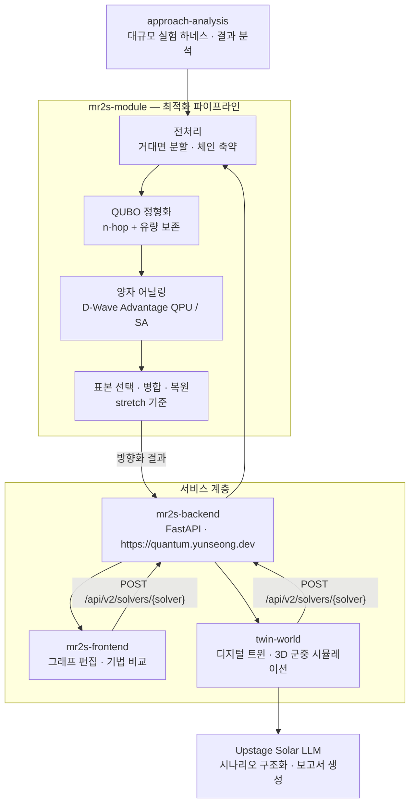
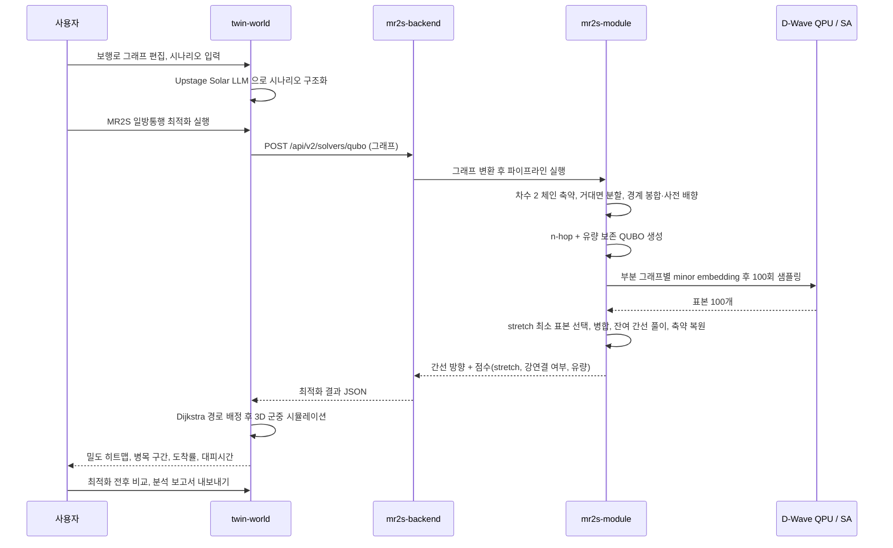

# MR2S — 양자 어닐링 기반 다중 밀집 사고 예방을 위한 보행자 네트워크 방향성 최적화

부산대학교 정보컴퓨터공학부 2026년 전기 졸업과제 36조 · Quantum Guardian

양방향 보행로 네트워크의 모든 간선에 일방통행 방향을 부여해, 어디에서 어디로든 갈 수 있는 상태(strong connectivity)를 유지하면서 대향류 충돌과 우회 거리를 줄이는 것이 이 과제의 목표다. 방향 배정 문제를 QUBO(Quadratic Unconstrained Binary Optimization) 모델로 정형화하고 실제 D-Wave 양자 어닐러에서 풀며, 그 결과를 디지털 트윈 Twin World 위 군중 시뮬레이션으로 검증한다. 제안 프레임워크의 이름 MR2S 는 Metropolitan Ring Road System 이다.

---

### 1. 프로젝트 배경

#### 1.1. 국내외 시장 현황 및 문제점

- **다중 밀집 사고는 보행 동선 설계 문제다.** 좁은 도시 공간에서 보행자 흐름이 통제력을 잃는 군중 유체화 현상으로 사고가 일어나며, 이태원 참사처럼 인구 밀집 도시 곳곳에서 반복된다. 주요 원인 중 하나는 서로 반대 방향으로 움직이는 조밀한 흐름이 한데 모일 때 생기는 대향류(opposing flows)의 물리적 충돌이다(최종보고서 1.1절).
- **일방통행 설계는 오래된 해법이지만 계산이 어렵다.** Robbins(1939)는 2-edge-connected 그래프라면 강연결 방향화가 항상 존재함을 보였으나, 그중 전 정점 쌍 최단 경로(APSP) 기준으로 최적인 것을 찾는 문제는 NP-hard 다(Duhamel & Santos, 2024). 간선이 $|E|$개면 탐색 공간이 $2^{|E|}$로 팽창한다.
- **고전 계산만으로는 대규모 네트워크를 다루기 어렵다.** 강연결성은 개별 간선의 국소적 선택이 아니라 네트워크 전체를 도는 순환 구조에 걸리는 전역 조건이라, 단순한 국소 탐색으로는 실행 가능한 해조차 얻기 어렵다.
- **양자 어닐링을 쓰려면 모델 자체를 다시 설계해야 한다.** 어닐러의 입력은 이진 변수의 2차 다항식이고, 3차 이상 항은 보조 변수로 차수를 낮춰야 한다. 게다가 Pegasus $P_{16}$ 은 고정된 희소 그래프라 큐비트 수보다 연결 구조가 더 큰 제약이며, minor embedding 탐색 자체가 NP-hard 다(최종보고서 2.2절).

#### 1.2. 필요성과 기대효과

- 축제·행사장처럼 하루 수만 명이 좁은 구역을 지나는 공간은 사고가 난 뒤에 동선을 고칠 수 없다. **행사 전에 동선안을 수치로 비교할 수 있는 수단**이 필요하다.
- 이 과제는 방향 최적화(MR2S)와 군중 시뮬레이션(Twin World)을 한 흐름으로 묶어, 최적화 전후 시나리오의 밀도 히트맵·병목 구간·정량 지표를 같은 조건에서 비교할 수 있게 한다.
- 정량적 기대효과는 4.5절에 정리했다. 요약하면 정점 500개 네트워크에서 제안 기법의 거리 비율(stretch)은 1.25~1.28로, 같은 품질대의 ILS(44,862초) 대비 약 1/10.5, Raw SA(101,597초) 대비 약 1/24 시간에 해를 얻는다.
- 정형화 자체는 보행로에 한정되지 않는다. 본 과제의 결과물은 대규모 네트워크에 대한 일반적인 강연결 방향 최적화 방법론이며, 다중 밀집 사고 예방은 일방통행화를 통한 대향류 제거라는 형태의 대표적인 응용이다(최종보고서 6장).

---

### 2. 개발 목표

#### 2.1. 목표 및 세부 내용

| 목표 | 세부 내용 | 결과물 |
| --- | --- | --- |
| 보조 변수 없는 QUBO 정형화 | $n$-hop 도달 가능 경로 수의 최대화를 이동 효율의 대리 목적으로 쓰고, 경로와 역경로가 짝을 이뤄 최고차 항이 상쇄되는 성질로 $n\in\{2,3\}$ 에서 2차식을 유지한다. 여기에 정점별 유량 보존 항을 더한다 | `mr2s-module/mr2s_module/qubo` |
| 전역 조건의 국소화 | 평면 그래프의 단위 면을 거대면(macro-face)으로 군집화하고 경계를 봉합해 순환 방향을 부여함으로써, 전역 강연결 조건을 각 부분 그래프의 국소 조건으로 낮춘다 | `mr2s-module/mr2s_module/cycle` |
| 하드웨어 탑재 최적화 | degeneracy 판정으로 분할 수 $k$를 이분 탐색하고, 차수 2 체인을 초간선으로 축약해 Pegasus $P_{16}$ 에 실을 수 있는 크기로 줄인다 | `mr2s-module/mr2s_module/reduction`, `mr2s_module/solver/partition` |
| 실제 양자 하드웨어 검증 | 부분 그래프 QUBO 를 D-Wave Advantage QPU 에서 샘플링하고 고전 기법과 비교한다 | 최종보고서 4.5절, `approach-analysis` |
| 동적 검증과 시연 | 방향화 결과를 디지털 트윈 군중 시뮬레이션에 넣어 밀도와 병목 변화를 확인한다 | `twin-world` |
| 서비스화 | 최적화를 HTTP API 로 제공하고 웹 클라이언트에서 호출한다 | `mr2s-backend`, `mr2s-frontend` |

주요 기능은 다음 네 가지다.

1. **일방통행 방향 최적화** — 무방향 그래프를 입력받아 간선별 방향과 stretch, 강연결 여부, 정점별 유량 균형을 돌려준다.
2. **기법 비교** — QUBO(양자 어닐링 / simulated annealing), Raw SA, Robbins, ILS, brute force 를 같은 입력에서 비교한다.
3. **디지털 트윈 시뮬레이션** — 보행로 그래프 위에서 3D 군중 시뮬레이션을 돌려 밀도 히트맵과 병목 구간을 본다.
4. **시나리오 비교와 보고서 생성** — 최적화 전후 지표를 비교하고 Upstage Solar LLM 으로 분석 보고서를 만든다.

#### 2.2. 기존 서비스 대비 차별성

| 항목 | 기존 방식 | 본 과제 |
| --- | --- | --- |
| 강연결성 처리 | QUBO 의 penalty term 으로 강제 → 전역 조건이라 저차 다항식으로 표현되지 않고, 큰 페널티가 어닐러의 유효 분해능을 잠식한다 | 전처리 단계에서 경계 사이클로 순환 골격을 먼저 세워, 에너지 함수에는 도달 가능성 항만 남긴다 |
| 목적 함수 차수 | 도달성을 직접 쓰면 3차 이상이 되어 보조 변수와 차수 축소가 필요하다(4-hop 은 변수 수가 약 8배) | 최고차 항이 상쇄되는 홉 길이 $n\in\{2,3\}$ 만 써서 보조 변수 없이 2차 유지 |
| 부분 문제 분해 | 기존 분할 정복은 제약이 없는 QUBO 를 대상으로 해 부분해를 단순 병합해도 된다 | 병합 후에도 강연결성이 유지되도록 면 단위로 나누고 거대면마다 순환 방향을 부여한다 |
| 문제 크기 | 정점 500개 그래프의 전체 QUBO 는 이진 변수 1,481개, 탐색 예산 안에 embedding 실패 | 분할 후 최대 부분 그래프 평균 263~365개, 정점 500개까지 전부 embedding 성공 |
| 계산 시간 | ILS 44,862초, Raw SA 101,597초 (정점 500 기준) | 합계 약 4,260초 (QUBO 풀이 자체는 16.9초) |
| 검증 방법 | 정적 경로 지표만 보고 | 같은 그래프를 3D 군중 시뮬레이션에 넣어 밀도·병목까지 동적으로 검증 |

#### 2.3. 사회적 가치 도입 계획

- **공공 안전**: 축제·행사 주최자가 행사 전에 동선안을 바꿔가며 병목과 밀집 위험을 확인할 수 있게 한다. 사고 후 대응이 아니라 설계 단계의 예방이 목표다.
- **기존 인프라 재사용**: 길을 새로 내지 않고 방향만 바꾸는 접근이라, 추가 공사 없이 기존 공간의 수용 능력을 끌어올린다.
- **공개와 재현성**: 알고리즘을 `mr2s-module` 파이썬 라이브러리로 분리하고, 실험 하네스와 결과 원본(JSON, 그림)을 `approach-analysis/results` 에 그대로 남겼다. 모든 해를 간선 방향 비트열로 저장한 뒤 집계 때 전부 복원·재평가해 기록 점수와 대조했고 불일치는 0건이었다.
- **하드웨어 접근성**: 양자 어닐러가 없는 환경을 위해 simulated annealing backend 를 같은 인터페이스로 제공해, 자격 증명 없이도 전체 흐름을 실행할 수 있다.

---

### 3. 시스템 설계

#### 3.1. 시스템 구성도

최적화 파이프라인(`mr2s-module`)이 전처리 → QUBO 정형화 → 양자 어닐링 실행의 세 단계로 방향화 결과를 산출하고, 디지털 트윈(`twin-world`)은 그 결과를 입력으로 받는 별도의 검증·시연 도구다(최종보고서 그림 3.1).



#### 3.2. 사용 기술

| 구분 | 기술 |
| --- | --- |
| 최적화 라이브러리 | Python 3.11+, `dwave-ocean-sdk`, `minorminer`, `dwave-networkx`, `networkx`, `numpy`, hatchling + hatch-vcs |
| 양자 하드웨어 | D-Wave Advantage QPU (Pegasus $P_{16}$, 5,640 qubits), minor embedding 은 minorminer (예산 1,000초, 고정·재사용) |
| 고전 backend | `dwave.samplers` 의 C++ simulated annealing 샘플러 |
| 백엔드 | FastAPI 0.133.0, uvicorn 0.41.0, pydantic 2.12.5, `mr2s-module` 0.1.8, Docker, GitHub Container Registry |
| 웹 클라이언트 | React 19, TypeScript 5.9, Vite 7, Three.js + `@react-three/fiber` + `@react-three/drei`, `@xyflow/react`, `@dagrejs/dagre`, i18next (한국어·영어·일본어) |
| 시뮬레이션 | 시각 휴리스틱 보행 모델(Moussaïd 등), 몸체 접촉력 모델(Helbing 등), Dijkstra 경로 탐색 |
| 외부 API | Upstage Solar LLM (Vercel serverless function 경유) |
| 실험·분석 | matplotlib, scipy, pytest, Wilcoxon 부호 순위 검정, Redis + AWS Batch + Amazon S3 기반 분산 실행 |
| 배포 | Vercel(`twin-world`, `mr2s-frontend`), GitHub Pages(`twinworld.maechuri.com`, 소개 영상), Docker 이미지 |
| 개발 도구 | ruff 0.16.0, pyright 1.1.411, oxlint, vitest, GitHub Actions |

---

### 4. 개발 결과

#### 4.1. 전체 시스템 흐름도



거대면 분할 전처리의 절차는 다음과 같다(최종보고서 알고리즘 1).

1. **면 추출** — 평면 embedding 에서 단위 면과 그 중심 좌표를 계산한다.
2. **초기 중심 선정** — 최원점 샘플링으로 서로 가장 멀리 떨어진 면 $k$개를 고른다.
3. **군집화** — 면 중심 좌표에 대한 k-means 반복으로 모든 면을 $k$개 군집에 배정한다.
4. **경계 봉합** — 외벽 간선에 높은 비용을 둔 최소 비용 T-조인으로 군집 경계를 닫는다.
5. **방향 부여** — 각 거대면에 순환 방향을 부여한다. 인접한 거대면은 항상 2-채색이 가능하므로 서로 반대의 순회 방향을 주면 공유 경계에서 양쪽 지시가 일치한다.

전체 시간 복잡도는 $O(|V| + \tau k|F| + |K_{\mathrm{odd}}|\cdot|E|\log|V| + |K_{\mathrm{odd}}|^3)$ 이다.

#### 4.2. 기능 설명 및 주요 기능 명세서

**HTTP API** (`mr2s-backend`, base URL `https://quantum.yunseong.dev`)

| method | path | 입력 | 출력 | 설명 |
| --- | --- | --- | --- | --- |
| `GET` | `/` | 없음 | 상태 메시지 | health check |
| `POST` | `/api/v1/mr2s` | 정점·간선 목록과 가중치 | 간선별 방향, 점수 | MR2S 파이프라인 고정 실행 (v1) |
| `POST` | `/api/v1/raw-sa` | 동일 | 동일 | 방향 벡터를 직접 탐색하는 simulated annealing |
| `POST` | `/api/v1/brute-force` | 동일 | 동일 | 전수 탐색, 소규모 그래프 검증용 |
| `GET` | `/api/v2/solvers` | 없음 | solver 목록과 옵션 | 사용 가능한 solver 조회 |
| `POST` | `/api/v2/solvers/{solver_name}` | 그래프 + solver 옵션 | 간선별 방향, 점수 | solver 를 경로 parameter 로 선택(`qubo`, `raw-sa`, `robin` 등) |

**라이브러리 공개 인터페이스** (`mr2s-module`)

| 구분 | 이름 | 설명 |
| --- | --- | --- |
| 데이터 모델 | `Graph`, `Edge`, `Solution`, `Score` | 입력 그래프와 결과 해, 평가 지표 |
| 분할 | `FaceClusterPartition`, `KMeansFaceClusterer`, `BalancedFaceGraphClusterer`, `SnowballFaceClusterer` | 거대면 군집화와 경계 봉합 |
| 축약 | `mr2s_module.reduction` | 차수 2 체인의 초간선 축약과 복원 |
| QUBO | `FlowPolyGenerator`, `NHopPolyGenerator`, `QuboSolver`, `create_sa_solver`, `create_qa_solver` | 목적 함수 생성과 풀이 backend |
| 평가 | `ApspSumRanker`, `Evaluator` | 표본 선택과 최종 평가 |
| 파이프라인 | `QuboMR2SSolver`, `DnCMr2sSolver`, `SAMR2SSolver`, `RobbinMR2SSolver`, `IlsMR2SSolver` | 전체 실행 진입점 |
| 비교 대상 | `Robbin`, `Tjoin` | QUBO 를 쓰지 않는 고전 방향화 |

**평가 지표** — stretch(방향화 전후 최단 거리 비율, 1이 최적), 강연결 성공률, 정점별 유량 균형, 벽시계 실행 시간, QUBO 변수 수와 커플링 밀도.

**디지털 트윈 기능** (`twin-world`)

| 기능 | 입력 | 출력 |
| --- | --- | --- |
| 그래프 편집 | 보행로 프리셋 또는 사용자 정의 노드·간선 | 시뮬레이션 대상 그래프 |
| 일방통행 최적화 | 편집한 그래프 | MR2S 가 계산한 간선 방향 |
| 군중 시뮬레이션 | 그래프, 인원수, 시나리오 | 이동 경로, 밀도 히트맵, 병목 구간, 도착률, 대피시간 |
| 시나리오 구조화 | 자연어 문장 | 인원수 등 구조화된 조건 |
| 결과 비교 | 최적화 전후 시뮬레이션 결과 | 지표별 비교표 |
| 보고서 생성 | 비교 결과 | Markdown 분석 보고서 |

#### 4.3. 디렉토리 구조

```
capstone-2026-team-36
├── README.md                 이 문서
├── install_and_build.sh      전체 구성 요소 설치·빌드 스크립트
├── docs/                     제출 문서
│   ├── 01.보고서/             착수·중간·최종 보고서
│   ├── 02.포스터/             포스터
│   ├── 03.발표자료/           발표자료
│   └── 04.자문의견서/         산업체 자문의견서
├── mr2s-module/              핵심 알고리즘 라이브러리 (Python)
│   ├── mr2s_module/
│   │   ├── domain/           Graph, Edge, Solution, Score 데이터 모델
│   │   ├── reduction/        차수 2 체인 축약 전처리
│   │   ├── cycle/            거대면 분할과 경계 봉합
│   │   ├── qubo/             QUBO 다항식 생성과 solver backend
│   │   ├── solver/           전체 파이프라인, 분할 정복 오케스트레이션
│   │   ├── edge_orient/      Robbins 등 QUBO 를 쓰지 않는 방향 배정
│   │   └── evaluator/        표본 선택과 최종 평가
│   ├── tests/                pytest 테스트와 데모 스크립트
│   └── docs/                 성능 분석 보고서와 실행 로그
├── mr2s-backend/             최적화 HTTP API (FastAPI)
│   ├── router/               v1, v2 라우터
│   ├── service/              solver catalog 와 최적화 서비스
│   ├── domain/               가중 그래프 모델
│   ├── dto/                  요청·응답 스키마
│   └── docs/                 API 명세
├── mr2s-frontend/            그래프 편집과 기법 비교 웹 클라이언트 (React)
├── twin-world/               디지털 트윈 시뮬레이션 (React + Three.js)
│   ├── src/                  graph, simulation, three, components, domain
│   ├── api/                  Upstage Solar LLM 호출 serverless function
│   └── docs/                 API 및 백엔드 참고 문서
├── simulation-react/         2D 군중 시뮬레이션 선행 프로토타입
├── simulation/               Unity 기반 초기 시뮬레이션 (웹 전환 이전 버전)
├── approach-analysis/        대규모 실험 하네스와 결과 원본
│   ├── src/commands/         분석 명령 구현
│   └── results/              JSON 원본, 그림, 분석 보고서
└── documents/                논문·보고서 원고와 소개 영상 자료
    ├── paper/ko, paper/en    논문 한국어판·영어판 (main.pdf 포함)
    ├── report/               보고서 원고 (main.pdf 포함)
    ├── AQC/                  AQC 2026 학회 발표 원고와 그림
    └── video/                소개 영상 페이지와 녹음 도구
```

#### 4.4. 산업체 멘토링 의견 및 반영 사항

자문: 샌드버그 이세진 이사, 2026년 8월 7일 13:00~15:00 서면 자문 (`docs/04.자문의견서/산업체_자문의견서.pdf`). 중간보고서를 검토하고 기술 구현도와 사업화 가능 여부에 대한 의견을 받았다.

| 자문 의견 | 반영 사항 |
| --- | --- |
| 초기 목표 대비 정량적 달성률(%)을 추진 계획표와 구성원별 담당 업무에 표기하면 최종 보고서로서 완결성이 개선된다 | 최종보고서 5장 개발 일정표에 항목별 달성률을 명시했다(4.6절) |
| AQC 학회 포스터 발표에서 논의된 피드백과 그에 대응하는 보완 로드맵을 연계해 작성할 것 | 학회 발표와 실기 검증 과정에서 확인된 하드웨어 embedding 규모 한계와 점수 정규화 필요성을 stretch 기반 점수 정규화와 차수 2 체인 축약으로 반영했다 |
| 정적 경로 지표(APSP) 외에 시뮬레이션을 통한 실제 밀집 완화 효과 데이터를 최종 결과물로 제시할 것 | Twin World 의 밀도 히트맵·병목 시각화와 최적화 전후 시나리오 비교 분석을 최종 결과물에 포함했다 |

과제 목표에 대해서는 "이론적 깊이와 실용적 가치(안전)를 모두 갖춘 독창적인 연구 주제"라는 평가와 함께, 보행 안전 관점의 최종 정량 목표치(병목 구간 대기 시간 감소율, 최대 보행자 밀도 완화율 등)를 추가하라는 의견을 받았다.

#### 4.5. 실험 결과 및 평가

검증은 목적이 다른 다섯 가지 실험으로 구성된다. 품질 지표는 stretch(방향화 전후 최단 거리 비율, 1이 최적), 실행 가능성은 강연결 성공률, 비용은 벽시계 실행 시간과 QUBO 변수 수·커플링 밀도다. 같은 그래프·같은 반복의 구성들이 동일한 seed 를 공유하는 짝지은 비교이며, 유의성은 Wilcoxon 부호 순위 검정으로 확인했다.

**(1) n-hop 대리 목적의 타당성** — 정점 50개(간선 137개) Delaunay 그래프에서 강연결 방향 조합 500개를 뽑아 유향 최단 경로 거리 합과 $n$-hop 도달 쌍 수의 상관을 측정했다. $n=2,3,4$ 모두 뚜렷한 음의 상관이 나타나, 도달 쌍 수 최대화를 거리 최소화의 대리 목적으로 쓰는 설계가 타당함을 확인했다. 다만 상관의 세기만 보면 $n=4$ 가 더 낫고, 홉 길이를 $\{2,3\}$ 으로 한정한 근거는 상관의 우열이 아니라 차수 조건이다.

**(2) hop 구성 실험 (본 실행 10,000회 + 대조 실행 2,000회)** — 정점 100~500 × 시드 10개 × 간선 제거 0/10/30/50% 의 Delaunay 그래프 200개 고정 인스턴스에, hop 구성 5종 × 체인 축약 on/off × 5회 반복을 돌렸다.

| 간선 제거 | h2 | h3 | h4 | h2+3 | h2+3+4 |
| --- | --- | --- | --- | --- | --- |
| 0% | **1.294** | 1.315 | 1.327 | 1.315 | 1.328 |
| 10% | **1.326** | 1.344 | 1.351 | 1.344 | 1.352 |
| 30% | 1.460 | 1.450 | 1.455 | **1.450** | 1.455 |
| 50% | 1.930 | 1.794 | 1.797 | **1.793** | 1.797 |

조밀한 그래프에서는 2-hop 이, 희소한 그래프에서는 3-hop 계열이 좋았다. 4-hop 계열은 보조 변수 때문에 변수 수와 실행 시간만 늘 뿐 어느 밀도에서도 3-hop 보다 좋지 않았다.

**(3) 차수 2 체인 축약의 효과** — 해 품질은 거의 그대로(stretch 차이 0.02 이하) 두면서 희소 그래프의 실행 시간을 최대 42%, QUBO 변수 수를 최대 89개(약 20%) 줄였다. 가장 큰 효과는 실행 가능성으로, 간선 50% 제거·정점 500 그래프에서 2-hop 의 강연결 성공률이 **38%에서 98%로**, 4-hop 이 82%에서 98%로 올랐다. 축약 없이는 분할에 실패하던 그래프도 축약 후에는 해를 구할 수 있었다.

**(4) 거대면 분할의 효과** — 전체 그래프를 한 QUBO 로 푸는 대조 실험에서 4-hop 계열은 강연결 해를 얻지 못했으나, 면 분할을 적용하면 96~100%의 성공률을 보였다. 해 품질도 3-hop 계열에서 면 분할이 전체 그래프 방식보다 stretch 를 0.02~0.04 개선했다($p<10^{-4}$). 1,000변수 이상의 QUBO 를 통째로 푸는 것보다, 경계를 먼저 잡고 수십~수백 개의 작은 QUBO 로 나누어 풀 때 더 좋은 해를 찾았다.

**(5) 그래프 계열 일반화** — grid, hexagonal, apollonian, voronoi 4개 계열에 같은 실험 행렬을 적용했다. 조밀할 때 2-hop, 희소할 때 3-hop 으로 갈리는 전환은 grid 에서도 재현되었고(전 정점 수에서 $p<0.001$), 차수가 3이면서 짧은 사이클이 없는 계열(hexagonal, voronoi)에서는 실험한 밀도 구간 전체에서 3-hop 항이 필수임이 새로 드러났다. 격자 계열은 강연결 성공률 자체가 낮아 2-hop 단독 구성이 정점 400~500에서 74~78%에 그쳤고, 4-hop 을 포함한 구성에서는 분할 실패 사례(grid 590건, hexagonal 610건)도 관찰되어 분할 전략의 개선 여지를 남겼다.

**(6) D-Wave 실기 검증과 고전 기법 비교** — 정점 100~500 Delaunay 그래프 각 3개, 총 15개 인스턴스를 D-Wave Advantage QPU 에서 부분 그래프별 100회 샘플링했다.

| 기법 | 거리 비율(방향화 후/전) | 인스턴스당 시간(초, $\|V\|=500$) | 강연결 확보 |
| --- | --- | --- | --- |
| 제안 기법 (D-Wave QA) | 1.25~1.28 | 16.9 (+4,243 embedding 탐색) | 14/15회 |
| ILS | 1.17~1.19 | 44,862 | 15/15회 |
| Raw SA | 1.22~∞ | 101,597 | 9/15회 |
| Robbins | 3.56~8.13 | 3.5 | 15/15회 |

- **embedding 가능성**: 분할하지 않으면 $|V|=100$ 에서만 평균 3,008개 물리 큐비트로 embedding 되고 $|V|\geq200$ 에서는 탐색 예산 안에 찾지 못했다. 분할하면 $|V|=500$ 까지 모든 부분 그래프가 embedding 되었다(부분 그래프당 물리 큐비트 최대 4,391개로 Pegasus $P_{16}$ 의 5,640개 이내).
- **해 품질**: 제안 기법의 거리 비율은 1.25~1.28로 그래프 규모와 무관하게 일정해, 평가 지표를 직접 최소화하는 ILS(1.17~1.19)와 0.1 이내 차이를 유지하고 고전 기준선 Robbins(3.56~8.13)를 크게 앞선다.
- **실행 시간**: 총 4,260초 중 4,243초가 embedding 탐색이고 실제 QUBO 풀이는 16.9초다. embedding 은 그래프 구조가 같으면 사전 계산·재사용할 수 있으므로, 같은 지형에 반복 적용하는 운용 시나리오에서는 인스턴스당 시간이 수십 초 수준까지 내려갈 여지가 있다.

**(7) 디지털 트윈 시뮬레이션 검증** — Twin World 에서 최적화 전(양방향)·후(일방통행) 시나리오를 비교해, 밀도 히트맵과 병목 시각화로 대향류 충돌 구간이 해소되고 최대 밀집 구간의 밀도가 완화됨을 확인했다. 보행자 조향은 Moussaïd 등의 시각 휴리스틱 모델을, 압착 압력의 근원인 몸체 접촉력은 Helbing 등의 패닉 모델을 따른다.

자세한 내용과 그림은 `docs/01.보고서/03.최종보고서.pdf` 4장, 실험 결과 원본은 `approach-analysis/results` 에 있다.

#### 4.6. 개발 일정 및 달성률

| 추진 항목 | 기간 | 달성률 |
| --- | --- | --- |
| 문제 정의·이론 연구 및 QUBO 모델 설계 | 2026. 3. ~ 5. | 100% |
| 거대면 분할 전처리 및 소규모 벤치마크 (착수보고) | 2026. 4. ~ 5. | 100% |
| AQC 2026 학회 포스터 발표 | 2026. 6. | 100% |
| D-Wave 실기 실행 및 embedding 대응 (중간보고) | 2026. 6. ~ 7. | 100% |
| 모듈 최적화 (체인 축약·stretch 정규화·가중치 조정) | 2026. 7. ~ 8. | 100% |
| 대규모 실험 (10,000회) 및 그래프 계열 일반화 실험 | 2026. 8. | 100% |
| Twin World 시뮬레이션 개발 및 동적 검증 | 2026. 7. ~ 9. | 100% |
| 최종 보고서 작성 및 발표 준비 | 2026. 9. | 100% |

#### 4.7. 대외 성과

- 2026년 6월 말 **AQC 2026 학회 포스터 발표** — 연구 내용을 외부에 공유하고 관련 연구자들의 피드백을 확보했다.
- **오제키 교수(Prof. Ozeki) 연구실 협력** — 실제 양자 어닐링 하드웨어 접근 권한을 지원받아 실기 검증을 수행했다.
- **Twin World 해커톤 수상** — 시뮬레이션 결과물을 해커톤에 출품해 수상했다.

---

### 5. 설치 및 실행 방법

#### 5.1. 설치절차 및 실행 방법

**사전 준비**

- Python 3.11 이상
- Node.js 20.19 이상 또는 22.12 이상
- (선택) D-Wave 계정과 `DWAVE_API_TOKEN`. 없으면 simulated annealing backend 로 전부 실행된다.
- (선택) Unity Editor 6000.4.1f1 — `simulation` 을 열 때만 필요하다.

**한 번에 설치·빌드**

```bash
./install_and_build.sh
```

**구성 요소별 실행**

```bash
# 1) 알고리즘 라이브러리
cd mr2s-module
python -m venv .venv && source .venv/bin/activate
pip install -e ".[test]"
pytest                                   # 테스트
python tests/run_sa_qubo_solver_demo.py --num-points 20 --num-reads 30 \
    --remove-ratio 0.3 --use-face-cycle --target-k 8   # 데모

# 2) 최적화 API 서버 — http://localhost:8000
cd ../mr2s-backend
pip install -r requirements.txt
python main.py

# 3) 그래프 편집·기법 비교 웹 클라이언트 — http://localhost:5173
cd ../mr2s-frontend
npm install && npm run dev

# 4) 디지털 트윈 — http://localhost:5173
cd ../twin-world
cp .env.example .env.local               # UPSTAGE_API_KEY, VITE_PROXY_TARGET 설정
npm install && npm run dev

# 5) 2D 시뮬레이션 프로토타입 — http://localhost:5173
cd ../simulation-react
npm install && npm run dev

# 6) 실험 재현
cd ../approach-analysis
pip install -r requirements.txt
python main.py poster-results --sizes 5 10 20 --output-dir results/poster --no-cache
```

| 구성 요소 | 포트 | 비고 |
| --- | --- | --- |
| `mr2s-backend` | 8000 | `docker build . && docker run -p 8000:8000 <image>` 로도 실행 가능 |
| `mr2s-frontend`, `twin-world`, `simulation-react` | 5173 | Vite 기본 포트. 동시에 띄우면 5174, 5175 로 밀린다 |

웹 클라이언트는 기본적으로 배포된 백엔드(`https://quantum.yunseong.dev`)를 프록시로 호출한다. 로컬 백엔드를 쓰려면 `vite.config.ts` 의 프록시 대상 또는 `twin-world` 의 `VITE_PROXY_TARGET` 을 `http://localhost:8000` 으로 바꾼다.

#### 5.2. 오류 발생 시 해결 방법

| 증상 | 원인 | 해결 |
| --- | --- | --- |
| `create_qa_solver` 호출이 자격 증명 오류로 실패 | D-Wave 토큰이 없다 | `DWAVE_API_TOKEN` 환경 변수를 설정하거나 `~/.config/dwave/dwave.conf` 를 만든다. 하드웨어 없이 돌리려면 `create_sa_solver` 를 쓴다 |
| embedding 탐색이 끝나지 않는다 | 분할 없이 큰 그래프를 그대로 넣었다 | `DnCMr2sSolver` 로 거대면 분할을 켠다. 정점 200개 이상은 분할 없이 embedding 되지 않는다 |
| 강연결 해를 얻지 못한다 | 희소한 그래프에서 체인 축약을 끄고 돌렸다 | 체인 축약을 켠다. 간선 50% 제거 그래프에서 성공률이 38%에서 98%로 올라간다 |
| 브라우저 콘솔에 CORS 오류 | 백엔드 allow origin 목록에 없는 주소에서 호출했다 | Vite 프록시 또는 `vercel.json` rewrite 를 통해 상대 경로로 호출한다 |
| `pytest` 가 매우 오래 걸린다 | `slow` 마커가 붙은 전체 QUBO 파이프라인 테스트가 포함됐다 | `python -m pytest -m "not slow"` 로 실행한다 |
| `npm run dev` 가 Node 버전 오류 | Vite 7 이 요구하는 Node 버전보다 낮다 | Node.js 20.19 이상 또는 22.12 이상으로 올린다 |
| `twin-world` 의 시나리오 구조화·보고서 생성이 동작하지 않는다 | `UPSTAGE_API_KEY` 가 없다 | `.env.local` 에 키를 넣는다. 키 없이도 시뮬레이션 자체는 동작한다 |
| `approach-analysis` 결과가 보고서 수치와 다르다 | `mr2s-module` 버전이 다르다 | `requirements.txt` 가 고정한 `mr2s-module==0.1.4` 를 그대로 쓴다 |

---

### 6. 소개 자료 및 시연 영상

#### 6.1. 프로젝트 소개 자료

| 자료 | 위치 |
| --- | --- |
| 최종 보고서 | `docs/01.보고서/03.최종보고서.pdf` |
| 포스터 | `docs/02.포스터/포스터파일.pdf` |
| 산업체 자문의견서 | `docs/04.자문의견서/산업체_자문의견서.pdf` |
| 발표자료 | `docs/03.발표자료/발표자료.pdf`, `발표자료.pptx` |
| 논문 한국어판 | `documents/paper/ko/main.pdf` |
| 논문 영어판 | `documents/paper/en/main.pdf` |

> **작성 필요** — `docs/01.보고서/01.착수보고서.pdf`, `02.중간보고서.pdf`, `docs/03.발표자료/` 의 두 파일은 아직 0바이트 자리표시자다.

#### 6.2. 시연 영상

소개 영상 페이지는 `documents/video/introduction/` 에 있고 GitHub Pages 로 배포된다(`documents/.github/workflows/deploy-video-introduction.yml`). 약 5분 40초 분량이다. 졸업과제 발표의 시연 자료로는 Twin World 시뮬레이션을 사용한다.

> **작성 필요** — 아래 링크와 썸네일을 실제 영상 주소로 바꾼다.
>
> ```markdown
> [](https://www.youtube.com/watch?v={동영상ID})
> ```

**배포된 데모**

| 서비스 | 주소 |
| --- | --- |
| Twin World (Vercel) | https://twin-world.vercel.app |
| Twin World (GitHub Pages) | https://twinworld.maechuri.com |
| 최적화 API | https://quantum.yunseong.dev |

---

### 7. 팀 구성

#### 7.1. 팀원별 소개 및 역할 분담

| 학번 | 성명 | 역할 |
| --- | --- | --- |
| 202155585 | 이요환 | 그래프 전처리 이론 연구 및 거대면 분할(face-cycle) 기법 개발 / 체인 축약 등 문제 규모 최적화 기법 개발 / `mr2s-module`·`mr2s-backend` 개발 / 대규모 실험 하네스 구축 / 보고서 작성 |
| 202155604 | 정윤성 | QUBO 목적 함수 정형화 및 최적화 / n-hop 접근법 이론 탐구 및 개발 / D-Wave Pegasus 토폴로지 대응(minor embedding) / `mr2s-module`·`mr2s-backend` 개발 / 연구 활동 기록화 및 포스터 작성 |
| 202155529 | 김세엽 | 디지털 트윈 시뮬레이션(Twin World) 및 `mr2s-frontend` 개발 / 테스트 코드 구현 및 통합 실행 / 프로젝트 서버 관리 / AQC 학회 포스터 발표 / 일본 측 협력 등 대외 소통 창구 |

지도교수: 황원주 (부산대학교 정보융합공학과)

#### 7.2. 팀원 별 참여 후기

> **작성 필요** — 팀원별로 느낀 점, 협업 과정, 기술적으로 어려웠던 점과 해결 과정을 각각 적는다.

**이요환**

**정윤성**

**김세엽**

---

### 8. 참고 문헌 및 출처

1. D. Helbing, L. Buzna, A. Johansson, and T. Werner, "Self-Organized Pedestrian Crowd Dynamics: Experiments, Simulations, and Design Solutions," *Transportation Science*, vol. 39, no. 1, pp. 1–24, Feb. 2005.
2. H. E. Robbins, "A Theorem on Graphs, with an Application to a Problem of Traffic Control," *The American Mathematical Monthly*, vol. 46, no. 5, pp. 281–283, May 1939.
3. F. Glover, G. Kochenberger, and Y. Du, "A Tutorial on Formulating and Using QUBO Models," arXiv:1811.11538, 2018.
4. C. Duhamel and A. C. Santos, "The Strong Network Orientation Problem," *International Transactions in Operational Research*, vol. 31, no. 1, pp. 192–220, Jan. 2024.
5. H. Ushijima-Mwesigwa, R. Shaydulin, C. F. A. Negre, S. M. Mniszewski, Y. Alexeev, and I. Safro, "Multilevel Combinatorial Optimization across Quantum Architectures," *ACM Transactions on Quantum Computing*, vol. 2, no. 1, art. 1, Mar. 2021.
6. J. Edmonds and E. L. Johnson, "Matching, Euler Tours and the Chinese Postman," *Mathematical Programming*, vol. 5, no. 1, pp. 88–124, Dec. 1973.
7. I. G. Rosenberg, "Reduction of Bivalent Maximization to the Quadratic Case," *Cahiers du Centre d'Études de Recherche Opérationnelle*, vol. 17, pp. 71–74, 1975.
8. D-Wave Systems Inc., *Ocean SDK Documentation*. [Online]. Available: https://docs.ocean.dwavesys.com
9. M. Moussaïd, D. Helbing, and G. Theraulaz, "How Simple Rules Determine Pedestrian Behavior and Crowd Disasters," *Proceedings of the National Academy of Sciences*, vol. 108, no. 17, pp. 6884–6888, Apr. 2011.
10. D. Helbing, I. Farkas, and T. Vicsek, "Simulating Dynamical Features of Escape Panic," *Nature*, vol. 407, pp. 487–490, Sep. 2000.
11. J. Cai, W. G. Macready, and A. Roy, "A Practical Heuristic for Finding Graph Minors," arXiv:1406.2741, 2014.
